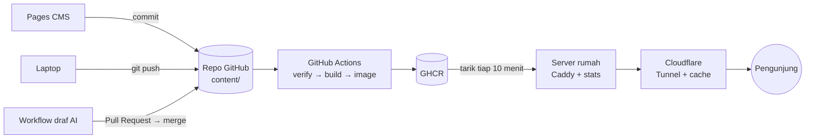

# harry.mardika.my.id

Website portfolio pribadi **Harry Mardika** (AI Product Manager; Founder, Decklify), dwibahasa, dengan CV dan Portfolio PDF yang dibuat otomatis, di-host sendiri di server rumah.

- **Live:** https://harry.mardika.my.id (Indonesia: https://harry.mardika.my.id/id/)
- **Status:** online sejak 2026-10-06. Fase 0–9 selesai; Fase 10 (CV per posisi) menunggu tinjauan pemilik; rencana Fase 11–13 (chatbot, formulir kesan & pesan, 3D tambahan) di [`docs/11-roadmap.md`](docs/11-roadmap.md). Detail di [`PROGRESS.md`](PROGRESS.md).
- **Dokumentasi:** [`docs/`](docs/README.md). Untuk pemilik, mulai dari **[panduan operasional](docs/10-operations.md)**.

## Fitur

| Fitur | Ringkasan |
|---|---|
| Dwibahasa | English di `/`, Bahasa Indonesia di `/id/`, dengan `hreflang` dan tombol ganti bahasa. Studi kasus juga diterjemahkan; angka mengikuti format tiap bahasa (`92.5%` / `92,5%`) |
| Satu sumber data | Semua isi (profil, pengalaman, proyek, dll.) ada di [`content/`](content/). Website, CV, dan Portfolio PDF membaca data yang sama. |
| CV & Portfolio PDF | Dibuat otomatis setiap build (EN dan ID). CV ramah ATS, maks. 2 halaman, tanpa nomor HP. Ditambah 6 CV per posisi (AI/ML, Data Engineer, Data Analyst, Product Manager, Project Manager, Management Trainee) di `/cv/` (tautan "Resumes" di footer) |
| Kesan & pesan | Pesan dari orang yang pernah bekerja dengan Harry di beranda, hanya dengan izin penulisnya (`content/messages.yaml`); tidak tampil jika kosong |
| 3D | Kartu foto 3D di hero dan jalur karier 3D (Three.js). Kartu statis untuk perangkat tanpa GPU, hemat data, atau *reduced motion*. |
| Edit dari browser | [Pages CMS](https://app.pagescms.org): setiap simpan menjadi commit dan tayang otomatis ([ADR 0011](docs/adr/0011-pages-cms.md)) |
| Proyek dari GitHub | Repo yang dipilih di `content/github.yaml` atau ber-topic `portfolio` tampil otomatis, diperbarui tiap 6 jam |
| Draf studi kasus oleh AI | Repo ber-topic `portfolio` tanpa studi kasus → Gemini (cadangan Groq) menulis draf dari README → Pull Request; **merge = tayang** ([ADR 0013](docs/adr/0013-ai-case-study-drafts.md)) |
| Statistik bawaan | Pengunjung, unduhan CV/Portfolio, sumber trafik, ditampilkan di `/stats/` (tautan di footer); tanpa cookie, tanpa layanan pihak ketiga ([ADR 0009](docs/adr/0009-built-in-stats.md)) |
| Tetap tersaji saat server mati | Cloudflare menyimpan halaman 7 hari; cache dihapus otomatis setiap deploy ([ADR 0012](docs/adr/0012-edge-cache-purge-on-deploy.md)) |
| Kualitas | Lighthouse ≥ 90 (performa) dan ≥ 95 (a11y, best practices, SEO) dijaga CI; header keamanan **A+** (Mozilla Observatory); SEO: sitemap, gambar pratinjau, JSON-LD |

## Cara kerja singkat



Setiap perubahan di `main` diperiksa (skema data, tes, Lighthouse), lalu dibangun menjadi image Docker. Server rumah menariknya sendiri, dan cache Cloudflare dihapus otomatis. Dari simpan sampai tayang ±20 menit. Detail: [docs/02-architecture.md](docs/02-architecture.md).

## Mengubah isi

| Cara | Kapan dipakai | Panduan |
|---|---|---|
| **Pages CMS** (browser, juga HP) | Mengubah teks, pengalaman, proyek, terjemahan | [docs/04 §1](docs/04-content-guide.md) |
| **Topic `portfolio` di repo GitHub** | Menambah proyek baru; draf studi kasus datang sebagai PR | [docs/04 §4](docs/04-content-guide.md) |
| **Laptop** (edit `content/`, commit, push) | Perubahan besar atau banyak file sekaligus | [docs/04](docs/04-content-guide.md), [docs/06](docs/06-development-workflow.md) |

Data yang tidak valid ditolak oleh CI dan situs lama tetap tayang; pesan error menyebut file, item, dan field-nya.

## Untuk pengembang

```bash
bun install
bun run dev                 # http://localhost:4321
bun run verify              # wajib sebelum commit: check → unit → e2e

# Atau dengan Docker, tanpa memasang Bun/Node di laptop
docker compose -f docker/compose.dev.yml up
```

Syarat: Bun 1.3+ dan Node.js 22.12+. Semua perintah: [docs/06-development-workflow.md](docs/06-development-workflow.md).

**AI agent dan kontributor:** baca **[`AGENTS.md`](AGENTS.md)** terlebih dahulu (urutan membaca dokumen, cara mengambil tugas, standar kode, Definition of Done), lalu [`PROGRESS.md`](PROGRESS.md).

**Tech stack** ([ADR](docs/adr/)): Astro 7 (SSG) · TypeScript strict · Bun · Tailwind CSS 4 · Three.js · Zod · Playwright (e2e, PDF, gambar pratinjau) · Caddy · Bun + SQLite (statistik) · Docker · GitHub Actions · Cloudflare Tunnel · Pages CMS · Gemini / Groq.

## Struktur repo

```
.
├── AGENTS.md · CLAUDE.md      # Aturan kerja untuk AI agent & developer (wajib dibaca)
├── PROGRESS.md · CHANGELOG.md # Status, log sesi, dan riwayat perubahan
├── .pages.yml                 # Konfigurasi editor browser Pages CMS
├── content/                   # SUMBER DATA: profil, pengalaman, proyek, media
├── src/                       # Astro: lib (logika murni), components, scenes (3D), pages, layouts
├── services/stats/            # Service statistik (Bun + SQLite)
├── scripts/                   # Build & alat: GitHub sync, PDF, gambar pratinjau, sitemap, CSP, draf AI
├── tests/                     # unit (bun test) & e2e (Playwright + axe)
├── docker/                    # Dockerfile, Caddyfile, compose produksi & dev, deploy/ (server)
├── .github/workflows/         # ci, deploy (+ jadwal 6 jam), case-study-drafts (harian)
└── docs/                      # Dokumentasi, ADR, prototipe tema
```

## Lisensi

Kode: [MIT](LICENSE). Isi pribadi di `content/` (teks, foto, data CV): © Harry Mardika, *all rights reserved*.
