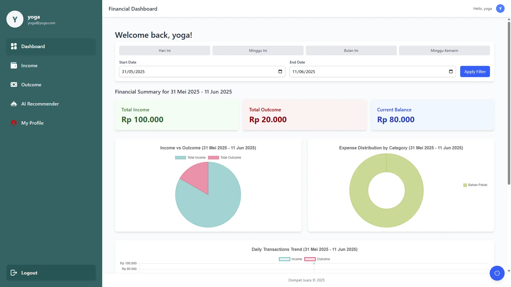

## Problem
Recording income and expenses is easy; understanding your spending habits and knowing what to change is not.

## Approach
Capstone project at Coding Camp powered by DBS Foundation, built as a progressive web app with a dashboard, income and expense records, an AI recommender that classifies the user's financial behavior and gives personalized tips, and an AI chat assistant. I led the ML team through the end-to-end pipeline, from data preparation and modeling to evaluation and deployment, and served the model with FastAPI and TensorFlow, integrated with the React.js frontend, the Hapi.js backend, and Supabase.

## Result
- 90% model accuracy.
- A complete app with mobile and desktop designs; code for the frontend, backend, and ML service is on GitHub.

