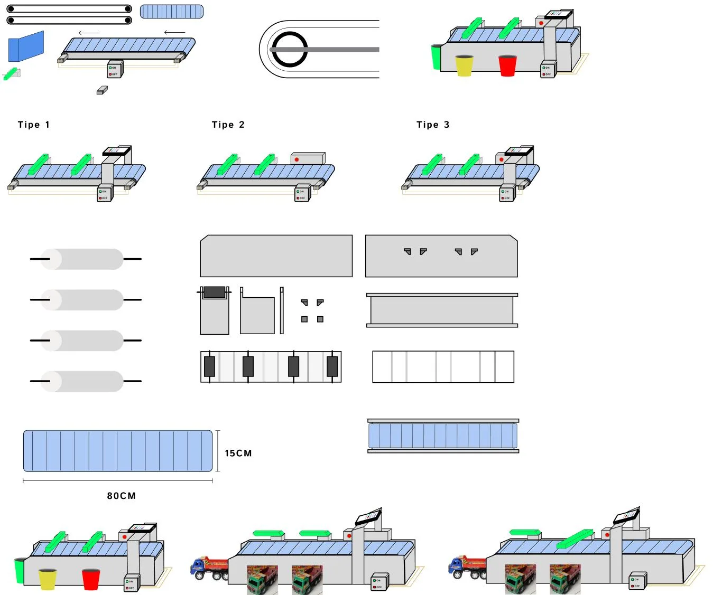
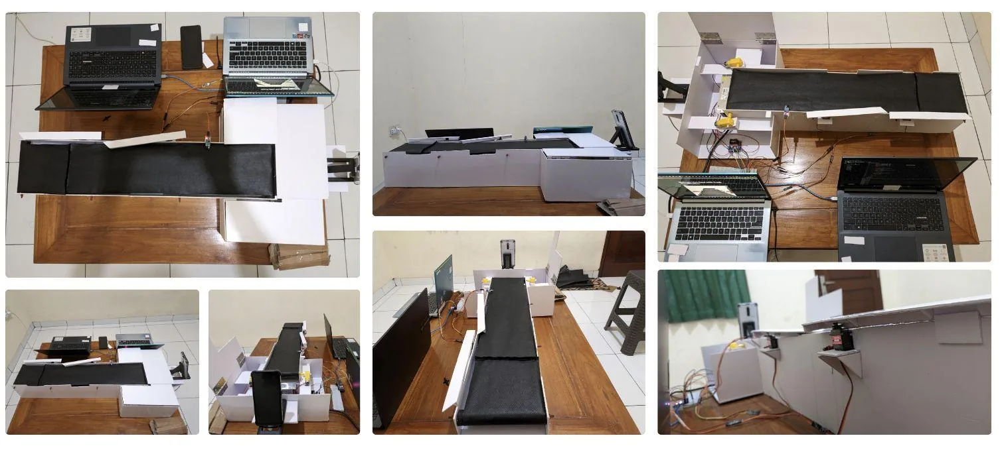

## Problem
Waste is still sorted by hand, which takes time and manual effort. Reclaimyt automates that step: sensors detect each item on the conveyor and the system separates it into the right bin.

## Approach
A team of four built a camera-equipped belt conveyor driven by an ESP32, with servo-driven gates that push each item into its bin. As the ML engineer, I collected and prepared the image data, built, trained, and experimented with the computer vision models, evaluated them, and deployed the final model to drive the sorting decisions.

## Result
- 90.9% validation accuracy.
- A working prototype that classifies and sorts items on the belt.
- Top 10 finalist at Samsung Innovation Campus Batch 5 (April–July 2024).

