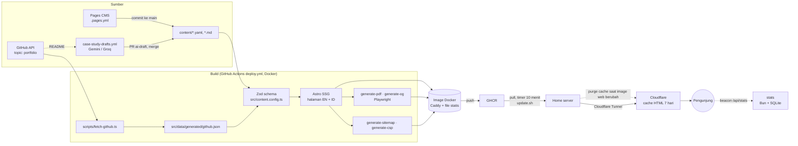

# 02 · Arsitektur

## 1. Gambaran besar



Prinsip utama:
1. **Statis terlebih dahulu.** Semua halaman di-render saat build dan disajikan Caddy. Proses aplikasi di runtime hanya dua layanan kecil: statistik + antrean kesan & pesan (`services/stats/`, ADR 0009, 0017) dan chatbot (`services/assistant/`, ADR 0014); jika keduanya mati, situs tetap utuh. Ini cepat, aman, dan cocok dengan cache CDN.
2. **Satu sumber data.** `content/` adalah satu-satunya tempat isi. Web, CV, dan Portfolio membaca data yang sama.
3. **Validasi saat build.** Data salah berarti build gagal, sehingga tidak pernah sampai ke production.
4. **3D adalah lapisan tambahan.** HTML statis sudah lengkap. Three.js hanya "menghias" jika perangkat mampu.

## 2. Tech stack

| Lapisan | Pilihan | Alasan (ADR) |
|---|---|---|
| Framework | Astro (SSG), TypeScript strict | 0001 |
| Runtime & package manager | Bun | 0001 |
| Styling | Tailwind CSS + CSS custom properties (tokens) | 0006 |
| 3D | Three.js vanilla, dimuat sebagai island | 0007 |
| Validasi data | Zod (Astro Content Layer) | 0002 |
| i18n | Routing bawaan Astro, `en` default | 0008 |
| PDF | Playwright mencetak halaman `/print/*` | 0003 |
| Statistik | Service kecil Bun + SQLite di domain yang sama | 0009 |
| Server web | Caddy (dalam image) | 0005 |
| CI/CD | GitHub Actions → GHCR → systemd timer (`docker compose pull`) | 0005, 0010 |
| Tes | `bun test` (unit), Playwright (e2e), axe (a11y) | – |
| Lint/format | ESLint + Prettier (dengan plugin Astro) | – |

Versi dikunci di `package.json`/`bun.lock`. Saat T1.1: Astro 7.3.5, TypeScript 6.0.3 (TS 7 belum didukung `@astrojs/check`), Node ≥ 22.12, Bun 1.3.

## 3. Lapisan dan arah dependensi

```
content/ (data)          ← tidak bergantung pada apa pun
   ↓
src/content.config.ts    ← skema Zod; satu-satunya yang tahu bentuk mentah data
   ↓
src/lib/**               ← logika murni (tanpa DOM, tanpa Astro API jika bisa), mudah dites
   ↓
src/components/**        ← presentasi (.astro), menerima data lewat props
   ↓
src/pages/**             ← komposisi: mengambil data via lib, merangkai komponen

src/scenes/**            ← modul 3D imperatif; hanya diimpor oleh <script> di komponen island
```

Aturan:
- Panah hanya boleh ke bawah. `lib` tidak boleh mengimpor `components`; `components` tidak boleh mengimpor `pages`.
- `scenes` tidak boleh mengimpor `components` atau `astro:*`. Data masuk lewat parameter atau atribut `data-*`.
- Komponen tidak memanggil `getCollection` atau `queries` sendiri. **Halaman** mengambil data lewat `@/lib/content/queries` lalu meneruskannya lewat props (contoh: halaman → `PageLayout profile={…}` → `Footer`).
- Menu utama hanya berisi halaman yang sudah ada. Saat membuat halaman baru, tambahkan item ke `NAV_ITEMS` di `src/lib/navigation.ts` dan kunci labelnya di kamus UI.
- Helper murni diimpor dari `@/lib/content` (aman untuk unit test). `@/lib/content/queries` memakai `astro:content`, jadi **tidak** boleh diimpor oleh unit test atau oleh helper murni.
- **Astro mengembalikan entri collection terurut berdasarkan `id`, bukan urutan file.** Collection yang urutannya bermakna (journey, skills) memakai `parseYamlList(..., { withPosition: true })` lalu diurutkan dengan `position` di `queries.ts`.
- Fungsi yang bergantung pada waktu (mis. sertifikat kedaluwarsa) menerima `now: Date` sebagai parameter agar hasil build dan tes dapat direproduksi.

## 4. Struktur folder

```
.
├── content/                     # SUMBER DATA (lihat docs/04-content-guide.md)
│   ├── profile.yaml
│   ├── experience.yaml
│   ├── education.yaml
│   ├── awards.yaml
│   ├── trainings.yaml
│   ├── certifications.yaml
│   ├── skills.yaml
│   ├── journey.yaml
│   ├── cv-variants.yaml         # varian CV per posisi (Fase 10): memilih & mengurutkan isi
│   ├── messages.yaml            # kesan & pesan dari orang lain (T9.4); yang dari formulir masuk lewat PR (ADR 0017)
│   ├── github.yaml              # repo GitHub yang ditampilkan (include, topic, exclude)
│   ├── projects/*.md            # studi kasus; projects/id/*.md = body bahasa Indonesia (T9.3)
│   └── media/                   # foto & gambar yang dipakai konten
├── src/
│   ├── content.config.ts        # mendaftarkan collection + loader (skema diimpor dari lib/content/schemas)
│   ├── lib/
│   │   ├── content/             # schemas/ (Zod, murni), yaml.ts (parser), helper murni (localize, localizeNumber,
│   │   │                        #   cv-variants, …), queries (astro:content)
│   │   ├── navigation.ts        # NAV_ITEMS (menu utama) dan label platform sosial
│   │   ├── site.ts, downloads.ts # URL situs; nama file dan path unduhan PDF (CV umum, varian, Portfolio)
│   │   ├── theme.ts             # logika tema terang/gelap
│   │   ├── i18n/                # locales.ts, ui.ts (kamus), format.ts (fill), routing.ts (path per bahasa)
│   │   ├── github/              # schemas, select (murni), client (REST, retry), sync (I/O diinjeksi)
│   │   ├── stats/               # events (skema payload), privacy, beacon, summary (format laporan)
│   │   ├── security/            # csp.ts: hash script inline → header CSP
│   │   ├── seo/                 # og (nama gambar pratinjau), sitemap/robots, json-ld, html (baca HTML build) (murni); person.ts (khusus Astro)
│   │   ├── ai/                  # penyedia model bersama (Gemini, Groq): dipakai draf AI dan chatbot (ADR 0013, 0014, 0015)
│   │   ├── drafts/              # draf studi kasus AI: candidates, prompt, schema (pengaman), markdown, providers, run
│   │   └── assistant/           # chatbot (ADR 0014): knowledge (skema), sections + project-sections + text (konten → teks),
│   │                            #   budget (token, versi ringkas, cek path, PHONE_PATTERN), ask (permintaan, prompt,
│   │                            #   pemeriksa jawaban), limits (batas pemakaian), chat (sisi browser: obrolan per tab,
│   │                            #   body permintaan, membaca jawaban), eval (penilai uji T11.5); tanpa API Node
│   ├── components/
│   │   ├── layout/              # Header, Footer, LangSwitch, ThemeToggle, MobileMenu, SkipLink, StatsBeacon
│   │   ├── ui/                  # Icon, DownloadIcon, RichText (generik, tanpa domain)
│   │   ├── hero/                # Hero.astro, HeroPrints.astro (foto + lembar aksara; slot ruang)
│   │   ├── journey/             # Journey.astro (timeline HTML + island 3D), MilestoneDetail (dialog)
│   │   ├── projects/            # ProjectRow + ProjectIndex (baris indeks, beranda), ProjectCard + ProjectGrid (kartu, /projects/ sampai T14.1),
│   │   │                        #   ProjectFilter (cari + bidang), SelectedProjects
│   │   ├── about/               # AboutSection, TimelineItem
│   │   ├── messages/            # Messages (kesan & pesan di beranda + ajakan, T9.4), MessageForm (formulir, T12.2),
│   │   │                        #   MessageReview (antrean privat pemilik, T12.3)
│   │   ├── assistant/           # AskWidget (chatbot di sudut, T11.4) + ask-panel.ts (dimuat saat diklik)
│   │   ├── contact/             # Contact (bagian kontak beranda)
│   │   ├── room/                # RoomStage (kanvas tetap "satu ruang", ADR 0019), HomeRoom (stage + skrip beranda)
│   │   ├── stats/               # SiteStats, ServerStatus (halaman /stats/)
│   │   └── print/               # CvDocument, CvEntry, PortfolioDocument
│   ├── scenes/
│   │   ├── core/                # capabilities (WebGL, hemat data, reduced motion), mount, loop, dispose, math,
│   │   │                        #   palette, pointer, types (kontrak SceneModule)
│   │   ├── room/                # "satu ruang" (ADR 0019): layout (halaman ↔ dunia, murni), index (createRoom, mountRoom),
│   │   │                        #   paper (label, kotak deteksi, bayangan lembut), parts/hero (+ hero-config), parts/journey
│   ├── layouts/                 # BaseLayout (dokumen, head, SEO, hreflang, tema) · PageLayout (skip link, header, main, footer)
│   │                            #   · PrintLayout (halaman cetak PDF)
│   ├── pages/
│   │   ├── [...locale]/         # SATU file per halaman untuk semua bahasa (lihat §7)
│   │   │   ├── index.astro, about.astro, stats.astro
│   │   │   ├── projects/index.astro, projects/[slug].astro
│   │   │   ├── messages/index.astro (formulir), messages/sent.astro, messages/not-sent.astro (noindex),
│   │   │   │   messages/review.astro (tinjau privat ber-token, noindex, tanpa statistik)
│   │   │   └── print/cv.astro, print/cv/[variant].astro, print/portfolio.astro; cv.astro (daftar CV per posisi)
│   │   ├── 404.astro, robots.txt.ts, assistant-knowledge.json.ts (sumber pengetahuan chatbot, hanya saat build)
│   │   └── og-template.astro    # templat gambar pratinjau (dipotret saat build)
│   ├── styles/                  # tokens.css, global.css
│   └── data/generated/          # output script build (di-gitignore)
├── services/stats/              # service statistik (Bun + bun:sqlite): store, handler, server; juga antrean kesan & pesan
│                                #   (messages, messages-store: messages.sqlite terpisah, token, ADR 0017)
├── services/assistant/          # chatbot "Tanya Harry" (Bun, tanpa penyimpanan): handler (POST /api/ask, health),
│                                #   routes (penyedia + pengetahuan, dipakai juga uji), server
├── scripts/                     # fetch-github, generate-pdf, generate-og, generate-sitemap, generate-knowledge, generate-csp, precompress,
│                                #   serve-build, lighthouse-summary, draft-case-studies, stats-report, check-tokens,
│                                #   assistant-eval (uji chatbot T11.5); kind-words (PR + notifikasi kesan & pesan, T12.4);
│                                #   lib/static-server.ts (server build untuk Chromium), lib/compression.ts
├── tests/
│   ├── unit/                    # cermin struktur src/lib
│   ├── e2e/                     # Playwright: halaman, i18n, 3D, unduhan, a11y (axe), SEO, deployment
│   └── eval/                    # assistant-cases.yaml: pertanyaan uji chatbot dengan model sungguhan (T11.5)
├── docker/                      # Dockerfile, Caddyfile, compose.yml, compose.dev.yml, deploy/ (timer, update, backup)
├── .pages.yml                   # editor browser Pages CMS untuk content/ (ADR 0011)
└── .github/workflows/           # ci.yml, deploy.yml, case-study-drafts.yml, assistant-eval.yml (§5)
```

## 5. Alur build

```
bun run build
  1. scripts/fetch-github.ts     → src/data/generated/github.json
                                   REST API, token opsional; repo dipilih lewat content/github.yaml;
                                   cache < 1 jam dipakai ulang; gagal → cache terakhir → daftar kosong;
                                   e2e terisolasi: GITHUB_FIXTURE=tests/fixtures/github.json,
                                   GITHUB_CACHE=…/github.e2e.json, output dist-e2e/ (tidak menyentuh dist/)
  2. astro build                 → dist/  (validasi Zod terjadi di sini)
  3. scripts/generate-pdf.ts     → <outDir>/downloads/*.pdf + downloads/cv/*.pdf (varian CV, didaftar di /cv/) (Bun.serve + Chromium, cetak /print/*; anggaran ukuran)
  4. scripts/generate-og.ts      → <outDir>/og/*.jpg (template /og-template/ + Chromium, 1200×630, ≤ 150 KB)
  5. scripts/generate-sitemap.ts → <outDir>/sitemap.xml (dari canonical + hreflang tiap halaman; noindex dilewati)
  6. scripts/generate-knowledge.ts → build-meta/knowledge.json (lengkap, EN+ID) + knowledge-compact.json (EN, ≤ 5 ribu token)
                                   untuk chatbot (ADR 0014): dari endpoint build /assistant-knowledge.json (query yang sama
                                   dengan halaman), path dicek terhadap output, gagal jika tautan mati, nomor HP, atau melebihi
                                   anggaran token; endpoint dihapus dari output
  7. scripts/generate-csp.ts     → build-meta/csp.caddy (hash setiap script inline; gagal jika ada font data:)
  Hanya di Docker: scripts/precompress.ts → salinan .br/.gz di samping file teks (docs/07 §4)
  BUILD_OUT_DIR mengganti folder output (Astro dan skrip PDF membaca variabel yang sama)
```

**Workflow GitHub Actions** (detail: [07 Deployment](07-deployment.md), [10 Operasional](10-operations.md)):

| Workflow | Pemicu | Isi |
|---|---|---|
| `ci.yml` (*CI*) | Pull request; dipanggil `deploy.yml` | `bun run verify` (check → unit → e2e), Lighthouse CI + ringkasan anotasi |
| `deploy.yml` (*Deploy*) | Push ke `main`, jadwal `17 */6 * * *` (UTC), manual | `ci.yml` → build image `web` + `stats` → push ke GHCR (`latest`, `sha-<commit>`) |
| `kind-words.yml` (*Kind words*) | Tiap jam (`publish`) dan 08.07 WIB (`notify`), manual | Pesan yang disetujui → terjemahan AI → satu PR antrean (`kind-words/queue`) → dihapus dari server; jumlah pesan menunggu → issue (email GitHub), tanpa isi pesan (T12.4, ADR 0017) |
| `assistant-eval.yml` (*Assistant eval*) | Manual saja | Build + ±30 pertanyaan uji ke chatbot dengan model sungguhan → laporan di ringkasan run (T11.5, `docs/assistant-eval.md`) |
| `case-study-drafts.yml` (*Case study drafts*) | Jadwal `41 2,14 * * *` (UTC, dua kali sehari), manual | `bun run drafts`: draf studi kasus AI → satu PR per proyek, grup repo = satu proyek (ADR 0013, 0016) |

**Sesudah image tayang di GHCR** (server, `docker/deploy/`): `portfolio-update.timer` (2 menit setelah boot, lalu tiap 10 menit) → `update.sh`: `docker compose pull` → `up -d --wait` → jika image `web` berubah, hapus cache Cloudflare untuk hostname situs (ADR 0010, 0012). Dari commit sampai tayang ±20 menit.

## 6. Kontrak modul 3D

Semua scene memakai `src/scenes/core/` (T2.1). Scene konkret hanya membangun objek dan menganimasikannya; urusan umum ditangani `mountScene`.

```ts
// src/scenes/core/mount.ts: dipanggil dari <script> komponen island
const handle = mountScene({ stage, canvas, create: createRoom(parts, shadows) }); // SceneHandle | null
handle?.destroy(); // aman dipanggil dua kali

// Scene konkret (sejak Fase 13 hanya ruang, src/scenes/room/index.ts) mengembalikan SceneModule:
interface SceneModule {
  scene: Scene; camera: Camera;
  update(frame: { dt; elapsed; pointer: { x; y } }): void; // dt sudah dijepit [0, 0.05]
  resize(width: number, height: number): void;
  dispose?(): void; // listener/timer/canvas texture; geometry & material dibersihkan otomatis
  needsRender?(): boolean; // opsional: false = frame ini tidak berubah, render dilewati (ADR 0019)
}
// create(setup) menerima { palette, renderer, mode: 'animated' | 'still', invalidate, ready }
```

`mountScene` menangani:
- **Keputusan 3D** (`decide3D`, murni): `off` tanpa WebGL, dengan Save-Data, atau CPU ≤ 2 core → mengembalikan `null` dan HTML fallback tetap tampil; `still` untuk `prefers-reduced-motion` (satu frame diam); selain itu `animated`. Status ditulis ke `stage.dataset.scene` (`animated`/`still`/`off`) untuk CSS dan tes.
- Renderer (`alpha`, DPR maksimal 2), ukuran mengikuti `stage` (`ResizeObserver`), pointer ternormalisasi -1..1, loop yang **berhenti saat stage tidak terlihat** (`IntersectionObserver`), dan error per frame yang dilaporkan tanpa menghentikan loop.
- Warna dari token CSS (`readPalette`), tidak pernah ditulis di kode scene.
- `destroy()`: hentikan loop, lepas observer/listener, `disposeObject3D(scene)`, `renderer.dispose()`.

Pelajaran dari prototipe: `dt` negatif pada frame pertama pernah merusak animasi; `frameDelta` kini selalu menjepitnya dan dites.

### 6.1 "Satu ruang" (ADR 0019, Fase 13)

Beranda (dan nanti halaman lain) memakai **satu** kanvas `position: fixed` di belakang `main` (`src/components/room/RoomStage.astro`), dipasang dengan `mountRoom(stage, parts)` dari `src/scenes/room/` lewat `mountScene` yang sama.

```ts
// src/scenes/room/index.ts
interface RoomPart {
  slot: HTMLElement;                         // elemen HTML yang diikuti (juga tempat fallback-nya)
  build(room): Object3D | Promise<Object3D>; // sekali, saat slot mendekati layar (BUILD_MARGIN)
  layout(room, rect: PageRect): void;        // posisi dari rect slot (koordinat dokumen)
  update?(frame): boolean;                   // true selama masih bergerak
  recolor?(palette): void;                   // tema berganti
  targets?(): RoomTarget[];                  // objek yang bisa diklik (wajib punya padanan HTML)
  dispose?(): void;
}
```

- **Halaman ↔ dunia** (`layout.ts`, murni dan dites): kamera berjarak `CAMERA.distance` dari bidang halaman (z = 0) dengan fov `CAMERA.fov`; `worldPerPixel` mengubah piksel CSS ke unit dunia. Bagian ditambatkan ke posisi dokumen slot di dalam grup `page`, dan scroll hanya menggeser grup itu (`pageOffset`), jadi 3D selalu sejajar dengan teksnya.
- **Dinding bayangan**: `ShadowMaterial` di z = −`WALL_DEPTH`, warnanya `--room-shadow`; hanya digambar bila ada peta bayangan. Satu `DirectionalLight` tetap dan `HemisphereLight`, warnanya dari `--room-sun/-sky/-ground`. Peta bayangan hanya bila `realtimeShadows` (≥ 6 core dan bukan layar sentuh); tanpa itu bagian menggambar bayangan lembut (`paper.ts`).
- **Stage**: `RoomStage.astro` setinggi `100lvh` (toolbar HP tidak mengubah skala) dan tidak boleh berada di dalam elemen ber-`transform`/`filter`/`contain`/`isolation`.
- **Bagian**: dibangun saat slotnya dekat, lalu shader-nya dikompilasi async (`compileAsync`) sebelum ditambahkan; bagian yang selesai setelah `destroy()` dibuang. `layout` dipanggil saat resize dan saat ukuran `body` berubah.
- **Render sesuai kebutuhan**: `needsRender()` true bila scroll, pointer (paralaks kecil), tema, atau `update()` sebuah bagian berubah.
- **Klik**: klik di luar elemen interaktif HTML di-raycast ke `targets()`, kecuali bila pointer bergeser > 5 px atau ada teks terpilih; `html.room-hover` memberi kursor tangan (mouse saja).
- **Tema**: `MutationObserver` pada `data-theme` dan `prefers-color-scheme` membaca ulang palet dan memanggil `recolor`.

## 7. i18n

- Locale: `en` (default, tanpa prefix) dan `id` (`/id/`). Konstanta di `src/lib/i18n/locales.ts`.
- **Pola halaman:** setiap halaman ada di `src/pages/[...locale]/` dan memakai `export const getStaticPaths = localeStaticPaths;`. Parameter `locale` kosong menghasilkan halaman EN tanpa prefix, `id` menghasilkan `/id/…`. Locale masuk lewat `Astro.props.locale`. Halaman dengan parameter lain (mis. `[slug]`) menggabungkan `localeStaticPaths()` dengan daftar slug.
- **URL:** jangan menulis path manual. Gunakan `localizePath(path, locale)` dan `alternates(pathname)` dari `@/lib/i18n` (semua path diakhiri `/`).
- `BaseLayout` otomatis menulis `<html lang>`, canonical, dan `hreflang` (`en`, `id`, `x-default`).
- Teks konten memakai tipe `LocalizedText = { en: string; id?: string }`. Helper `localize(text, locale)` mengembalikan `id` jika ada, jika tidak `en`.
- Angka yang ditulis sekali untuk dua bahasa (`value` di `stats`/`metrics`, `gpa`) ditulis gaya Inggris dan ditampilkan lewat `localizeNumber(value, locale)`: `92.5%` → `92,5%` di halaman dan PDF Indonesia (D16, T9.5).
- Body studi kasus bahasa Indonesia ada di `content/projects/id/<slug>.md`; bila belum ada, halaman `id` memakai body Inggris dengan catatan (T9.3).
- Teks UI ada di `src/lib/i18n/ui.ts` sebagai kamus bertipe, sehingga kunci yang hilang menjadi error TypeScript.

## 8. Keamanan

- Tidak ada secret di klien. `GITHUB_TOKEN` hanya dipakai saat build.
- Header keamanan diatur di `docker/Caddyfile` (CSP ketat, HSTS, `X-Content-Type-Options`, `Referrer-Policy`, `Permissions-Policy`).
- Tidak ada script pihak ketiga. Statistik memakai endpoint di domain sendiri (`/api/stats/*`).
