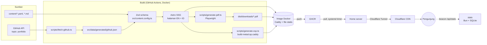

# 02 · Arsitektur

## 1. Gambaran besar



Prinsip utama:
1. **Statis terlebih dahulu.** Semua halaman di-render saat build dan disajikan Caddy. Satu-satunya proses aplikasi di runtime adalah service statistik kecil (`services/stats/`, ADR 0009); jika ia mati, situs tetap utuh. Ini cepat, aman, dan cocok dengan cache CDN.
2. **Satu sumber data.** `content/` adalah satu-satunya tempat isi. Web, CV, dan Portfolio membaca data yang sama.
3. **Validasi saat build.** Data salah berarti build gagal, sehingga tidak pernah sampai ke production.
4. **3D adalah lapisan tambahan.** HTML statis sudah lengkap. Three.js hanya "menghias" jika perangkat mampu.

## 2. Tech stack

| Lapisan | Pilihan | Alasan (ADR) |
|---|---|---|
| Framework | Astro (SSG), TypeScript strict | 0001 |
| Runtime & package manager | Bun | 0001 |
| Styling | Tailwind CSS + CSS custom properties (tokens) | 0006 |
| 3D | Three.js vanilla, dimuat sebagai island | 0007 |
| Validasi data | Zod (Astro Content Layer) | 0002 |
| i18n | Routing bawaan Astro, `en` default | 0008 |
| PDF | Playwright mencetak halaman `/print/*` | 0003 |
| Statistik | Service kecil Bun + SQLite di domain yang sama | 0009 |
| Server web | Caddy (dalam image) | 0005 |
| CI/CD | GitHub Actions → GHCR → systemd timer (`docker compose pull`) | 0005, 0010 |
| Tes | `bun test` (unit), Playwright (e2e), axe (a11y) | – |
| Lint/format | ESLint + Prettier (dengan plugin Astro) | – |

Versi dikunci di `package.json`/`bun.lock`. Saat T1.1: Astro 7.3.5, TypeScript 6.0.3 (TS 7 belum didukung `@astrojs/check`), Node ≥ 22.12, Bun 1.3.

## 3. Lapisan dan arah dependensi

```
content/ (data)          ← tidak bergantung pada apa pun
   ↓
src/content.config.ts    ← skema Zod; satu-satunya yang tahu bentuk mentah data
   ↓
src/lib/**               ← logika murni (tanpa DOM, tanpa Astro API jika bisa), mudah dites
   ↓
src/components/**        ← presentasi (.astro), menerima data lewat props
   ↓
src/pages/**             ← komposisi: mengambil data via lib, merangkai komponen

src/scenes/**            ← modul 3D imperatif; hanya diimpor oleh <script> di komponen island
```

Aturan:
- Panah hanya boleh ke bawah. `lib` tidak boleh mengimpor `components`; `components` tidak boleh mengimpor `pages`.
- `scenes` tidak boleh mengimpor `components` atau `astro:*`. Data masuk lewat parameter atau atribut `data-*`.
- Komponen tidak memanggil `getCollection` atau `queries` sendiri. **Halaman** mengambil data lewat `@/lib/content/queries` lalu meneruskannya lewat props (contoh: halaman → `PageLayout profile={…}` → `Footer`).
- Menu utama hanya berisi halaman yang sudah ada. Saat membuat halaman baru, tambahkan item ke `NAV_ITEMS` di `src/lib/navigation.ts` dan kunci labelnya di kamus UI.
- Helper murni diimpor dari `@/lib/content` (aman untuk unit test). `@/lib/content/queries` memakai `astro:content`, jadi **tidak** boleh diimpor oleh unit test atau oleh helper murni.
- **Astro mengembalikan entri collection terurut berdasarkan `id`, bukan urutan file.** Collection yang urutannya bermakna (journey, skills) memakai `parseYamlList(..., { withPosition: true })` lalu diurutkan dengan `position` di `queries.ts`.
- Fungsi yang bergantung pada waktu (mis. sertifikat kedaluwarsa) menerima `now: Date` sebagai parameter agar hasil build dan tes dapat direproduksi.

## 4. Struktur folder (target)

```
.
├── content/                     # SUMBER DATA (lihat docs/04-content-guide.md)
│   ├── profile.yaml
│   ├── experience.yaml
│   ├── education.yaml
│   ├── awards.yaml
│   ├── trainings.yaml
│   ├── certifications.yaml
│   ├── skills.yaml
│   ├── journey.yaml
│   ├── projects/*.md
│   └── media/                   # foto & gambar yang dipakai konten
├── src/
│   ├── content.config.ts        # mendaftarkan collection + loader (skema diimpor dari lib/content/schemas)
│   ├── lib/
│   │   ├── content/             # schemas/ (Zod, murni), yaml.ts (parser), helper murni, queries (astro:content)
│   │   ├── navigation.ts        # NAV_ITEMS (menu utama) dan label platform sosial
│   │   ├── theme.ts             # logika tema terang/gelap
│   │   ├── i18n/                # locales.ts, ui.ts (kamus), t(), path helpers
│   │   ├── github/              # schemas, select (murni), client (REST, retry), sync (I/O diinjeksi)
│   │   ├── stats/               # events (skema payload), privacy, beacon, summary (format laporan)
│   │   ├── security/            # csp.ts: hash script inline → header CSP
│   │   └── seo/                 # og (nama gambar pratinjau), sitemap/robots, json-ld (murni); person.ts (khusus Astro)
│   ├── components/
│   │   ├── layout/              # BaseLayout, Header, Footer, LangSwitch, ThemeToggle, SkipLink
│   │   ├── ui/                  # Button, Badge, Stat, Icon, Card, Dialog (generik, tanpa domain)
│   │   ├── hero/                # Hero.astro (+ island kartu 3D)
│   │   ├── journey/             # Journey.astro, JourneyTimeline.astro (fallback)
│   │   ├── projects/            # ProjectCard, ProjectGrid, TagFilter
│   │   ├── about/               # AboutSection, TimelineItem
│   │   ├── contact/             # Contact (bagian kontak beranda)
│   │   └── print/               # CvDocument, PortfolioDocument
│   ├── scenes/
│   │   ├── core/                # createRenderer, loop, visibility, reducedMotion, webglSupport, dispose
│   │   ├── photo-card/          # kartu foto 3D + kotak deteksi
│   │   └── journey-path/        # jalur karier 3D
│   ├── layouts/                 # BaseLayout (dokumen, head, SEO, hreflang, tema) · PageLayout (skip link, header, main, footer)
│   ├── pages/
│   │   ├── [...locale]/         # SATU file per halaman untuk semua bahasa (lihat §7)
│   │   │   ├── index.astro, about.astro, homelab.astro
│   │   │   ├── projects/index.astro, projects/[slug].astro
│   │   │   └── print/cv.astro, print/portfolio.astro
│   │   └── 404.astro
│   ├── styles/                  # tokens.css, global.css
│   └── data/generated/          # output script build (di-gitignore)
├── services/stats/              # service statistik (Bun + bun:sqlite): store, handler, server
├── scripts/                     # fetch-github, generate-pdf, generate-og, generate-sitemap, generate-csp, precompress,
│                                #   stats-report, check-tokens; lib/static-server.ts (server build untuk Chromium)
├── tests/
│   ├── unit/                    # cermin struktur src/lib
│   └── e2e/                     # Playwright: smoke, i18n, download, a11y
├── docker/                      # Dockerfile, Caddyfile, compose.yml, compose.dev.yml, deploy/ (timer, update, backup)
├── .pages.yml                   # editor browser Pages CMS untuk content/ (ADR 0011)
└── .github/workflows/           # ci.yml, deploy.yml
```

## 5. Alur build

```
bun run build
  1. scripts/fetch-github.ts     → src/data/generated/github.json
                                   REST API, token opsional; repo dipilih lewat content/github.yaml;
                                   cache < 1 jam dipakai ulang; gagal → cache terakhir → daftar kosong;
                                   e2e terisolasi: GITHUB_FIXTURE=tests/fixtures/github.json,
                                   GITHUB_CACHE=…/github.e2e.json, output dist-e2e/ (tidak menyentuh dist/)
  2. astro build                 → dist/  (validasi Zod terjadi di sini)
  3. scripts/generate-pdf.ts     → <outDir>/downloads/*.pdf (Bun.serve + Chromium, cetak /print/*; anggaran ukuran)
  4. scripts/generate-og.ts      → <outDir>/og/*.jpg (template /og-template/ + Chromium, 1200×630, ≤ 150 KB)
  5. scripts/generate-sitemap.ts → <outDir>/sitemap.xml (dari canonical + hreflang tiap halaman; noindex dilewati)
  6. scripts/generate-csp.ts     → build-meta/csp.caddy (hash setiap script inline; gagal jika ada font data:)
  Hanya di Docker: scripts/precompress.ts → salinan .br/.gz di samping file teks (docs/07 §4)
  BUILD_OUT_DIR mengganti folder output (Astro dan skrip PDF membaca variabel yang sama)
```

## 6. Kontrak modul 3D

Semua scene memakai `src/scenes/core/` (T2.1). Scene konkret hanya membangun objek dan menganimasikannya; urusan umum ditangani `mountScene`.

```ts
// src/scenes/core/mount.ts: dipanggil dari <script> komponen island
const handle = mountScene({ stage, canvas, create: createPhotoCard }); // SceneHandle | null
handle?.destroy(); // aman dipanggil dua kali

// Scene konkret (mis. src/scenes/photo-card/index.ts) mengembalikan SceneModule:
interface SceneModule {
  scene: Scene; camera: Camera;
  update(frame: { dt; elapsed; pointer: { x; y } }): void; // dt sudah dijepit [0, 0.05]
  resize(width: number, height: number): void;
  dispose?(): void; // listener/timer/canvas texture; geometry & material dibersihkan otomatis
}
// create(setup) menerima { palette, mode: 'animated' | 'still', invalidate }
```

`mountScene` menangani:
- **Keputusan 3D** (`decide3D`, murni): `off` tanpa WebGL, dengan Save-Data, atau CPU ≤ 2 core → mengembalikan `null` dan HTML fallback tetap tampil; `still` untuk `prefers-reduced-motion` (satu frame diam); selain itu `animated`. Status ditulis ke `stage.dataset.scene` (`animated`/`still`/`off`) untuk CSS dan tes.
- Renderer (`alpha`, DPR maksimal 2), ukuran mengikuti `stage` (`ResizeObserver`), pointer ternormalisasi -1..1, loop yang **berhenti saat stage tidak terlihat** (`IntersectionObserver`), dan error per frame yang dilaporkan tanpa menghentikan loop.
- Warna dari token CSS (`readPalette`), tidak pernah ditulis di kode scene.
- `destroy()`: hentikan loop, lepas observer/listener, `disposeObject3D(scene)`, `renderer.dispose()`.

Pelajaran dari prototipe: `dt` negatif pada frame pertama pernah merusak animasi; `frameDelta` kini selalu menjepitnya dan dites.

## 7. i18n

- Locale: `en` (default, tanpa prefix) dan `id` (`/id/`). Konstanta di `src/lib/i18n/locales.ts`.
- **Pola halaman:** setiap halaman ada di `src/pages/[...locale]/` dan memakai `export const getStaticPaths = localeStaticPaths;`. Parameter `locale` kosong menghasilkan halaman EN tanpa prefix, `id` menghasilkan `/id/…`. Locale masuk lewat `Astro.props.locale`. Halaman dengan parameter lain (mis. `[slug]`) menggabungkan `localeStaticPaths()` dengan daftar slug.
- **URL:** jangan menulis path manual. Gunakan `localizePath(path, locale)` dan `alternates(pathname)` dari `@/lib/i18n` (semua path diakhiri `/`).
- `BaseLayout` otomatis menulis `<html lang>`, canonical, dan `hreflang` (`en`, `id`, `x-default`).
- Teks konten memakai tipe `LocalizedText = { en: string; id?: string }`. Helper `localize(text, locale)` mengembalikan `id` jika ada, jika tidak `en`.
- Teks UI ada di `src/lib/i18n/ui.ts` sebagai kamus bertipe, sehingga kunci yang hilang menjadi error TypeScript.

## 8. Keamanan

- Tidak ada secret di klien. `GITHUB_TOKEN` hanya dipakai saat build.
- Header keamanan diatur di `docker/Caddyfile` (CSP ketat, HSTS, `X-Content-Type-Options`, `Referrer-Policy`, `Permissions-Policy`).
- Tidak ada script pihak ketiga. Statistik memakai endpoint di domain sendiri (`/api/stats/*`).
