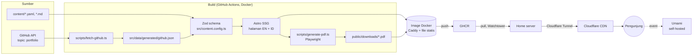

# 02 · Arsitektur

## 1. Gambaran besar



Prinsip utama:
1. **Statis terlebih dahulu.** Semua halaman di-render saat build. Tidak ada server aplikasi di runtime. Ini cepat, aman, dan cocok dengan cache CDN.
2. **Satu sumber data.** `content/` adalah satu-satunya tempat isi. Web, CV, dan Portfolio membaca data yang sama.
3. **Validasi saat build.** Data salah berarti build gagal, sehingga tidak pernah sampai ke production.
4. **3D adalah lapisan tambahan.** HTML statis sudah lengkap. Three.js hanya "menghias" jika perangkat mampu.

## 2. Tech stack

| Lapisan | Pilihan | Alasan (ADR) |
|---|---|---|
| Framework | Astro (SSG), TypeScript strict | 0001 |
| Runtime & package manager | Bun | 0001 |
| Styling | Tailwind CSS + CSS custom properties (tokens) | 0006 |
| 3D | Three.js vanilla, dimuat sebagai island | 0007 |
| Validasi data | Zod (Astro Content Layer) | 0002 |
| i18n | Routing bawaan Astro, `en` default | 0008 |
| PDF | Playwright mencetak halaman `/print/*` | 0003 |
| Analytics | Umami self-hosted | 0004 |
| Server web | Caddy (dalam image) | 0005 |
| CI/CD | GitHub Actions → GHCR → Watchtower | 0005 |
| Tes | `bun test` (unit), Playwright (e2e), axe (a11y) | – |
| Lint/format | ESLint + Prettier (dengan plugin Astro) | – |

Versi dikunci di `package.json`/`bun.lock`. Saat T1.1: Astro 7.3.5, TypeScript 6.0.3 (TS 7 belum didukung `@astrojs/check`), Node ≥ 22.12, Bun 1.3.

## 3. Lapisan dan arah dependensi

```
content/ (data)          ← tidak bergantung pada apa pun
   ↓
src/content.config.ts    ← skema Zod; satu-satunya yang tahu bentuk mentah data
   ↓
src/lib/**               ← logika murni (tanpa DOM, tanpa Astro API jika bisa), mudah dites
   ↓
src/components/**        ← presentasi (.astro), menerima data lewat props
   ↓
src/pages/**             ← komposisi: mengambil data via lib, merangkai komponen

src/scenes/**            ← modul 3D imperatif; hanya diimpor oleh <script> di komponen island
```

Aturan:
- Panah hanya boleh ke bawah. `lib` tidak boleh mengimpor `components`; `components` tidak boleh mengimpor `pages`.
- `scenes` tidak boleh mengimpor `components` atau `astro:*`. Data masuk lewat parameter atau atribut `data-*`.
- Komponen tidak memanggil `getCollection` secara langsung. Ambil data lewat `@/lib/content/queries` (sudah difilter dan diurutkan).
- Helper murni diimpor dari `@/lib/content` (aman untuk unit test). `@/lib/content/queries` memakai `astro:content`, jadi **tidak** boleh diimpor oleh unit test atau oleh helper murni.
- Fungsi yang bergantung pada waktu (mis. sertifikat kedaluwarsa) menerima `now: Date` sebagai parameter agar hasil build dan tes dapat direproduksi.

## 4. Struktur folder (target)

```
.
├── content/                     # SUMBER DATA (lihat docs/04-content-guide.md)
│   ├── profile.yaml
│   ├── experience.yaml
│   ├── education.yaml
│   ├── awards.yaml
│   ├── trainings.yaml
│   ├── certifications.yaml
│   ├── skills.yaml
│   ├── journey.yaml
│   ├── projects/*.md
│   └── media/                   # foto & gambar yang dipakai konten
├── src/
│   ├── content.config.ts        # mendaftarkan collection + loader (skema diimpor dari lib/content/schemas)
│   ├── lib/
│   │   ├── content/             # schemas/ (Zod, murni), yaml.ts (parser), helper murni, queries (astro:content)
│   │   ├── i18n/                # locales.ts, ui.ts (kamus), t(), path helpers
│   │   ├── github/              # client.ts (I/O) + map.ts (murni)
│   │   ├── analytics/           # events.ts (konstanta nama event), track.ts
│   │   └── seo/                 # meta, JSON-LD builders
│   ├── components/
│   │   ├── layout/              # BaseLayout, Header, Footer, LangSwitch, ThemeToggle, SkipLink
│   │   ├── ui/                  # Button, Badge, Stat, Icon, Card, Dialog (generik, tanpa domain)
│   │   ├── hero/                # Hero.astro (+ island kartu 3D)
│   │   ├── journey/             # Journey.astro, JourneyTimeline.astro (fallback)
│   │   ├── projects/            # ProjectCard, ProjectGrid, TagFilter
│   │   ├── about/               # ExperienceList, EducationList, CertificationList, SkillGroups
│   │   └── print/               # CvDocument, PortfolioDocument
│   ├── scenes/
│   │   ├── core/                # createRenderer, loop, visibility, reducedMotion, webglSupport, dispose
│   │   ├── photo-card/          # kartu foto 3D + kotak deteksi
│   │   └── journey-path/        # jalur karier 3D
│   ├── layouts/                 # BaseLayout (dokumen HTML, head, hreflang)
│   ├── pages/
│   │   ├── [...locale]/         # SATU file per halaman untuk semua bahasa (lihat §7)
│   │   │   ├── index.astro, about.astro, homelab.astro
│   │   │   ├── projects/index.astro, projects/[slug].astro
│   │   │   └── print/cv.astro, print/portfolio.astro
│   │   └── 404.astro
│   ├── styles/                  # tokens.css, global.css
│   └── data/generated/          # output script build (di-gitignore)
├── scripts/                     # fetch-github.ts, generate-pdf.ts (CLI, dipanggil saat build)
├── tests/
│   ├── unit/                    # cermin struktur src/lib
│   └── e2e/                     # Playwright: smoke, i18n, download, a11y
├── docker/                      # Dockerfile, Caddyfile, compose.yml, compose.dev.yml
└── .github/workflows/           # ci.yml, deploy.yml
```

## 5. Alur build

```
bun run build
  1. scripts/fetch-github.ts     → src/data/generated/github.json  (gagal? pakai cache terakhir)
  2. astro build                 → dist/  (validasi Zod terjadi di sini)
  3. scripts/generate-pdf.ts     → dist/downloads/*.pdf (serve dist/, cetak /print/*)
```

## 6. Kontrak modul 3D

Setiap scene di `src/scenes/<nama>/index.ts` mengekspor satu fungsi:

```ts
export interface SceneHandle {
  /** Stop the loop and free GPU resources. Must be safe to call twice. */
  destroy(): void;
}

export interface SceneOptions {
  reducedMotion: boolean;   // true → render a single still frame
  palette: ScenePalette;    // colors resolved from CSS tokens, never hardcoded
}

export function mountPhotoCard(canvas: HTMLCanvasElement, opts: SceneOptions & { photoUrl: string }): SceneHandle;
```

Wajib di `core/`: deteksi WebGL (gagal → biarkan fallback HTML), pause saat tidak terlihat (`IntersectionObserver`), `devicePixelRatio` maksimal 2, `dt` dijepit `[0, 0.05]`, dan `try/catch` per frame agar satu scene tidak mematikan scene lain.
Pelajaran dari prototipe: `dt` negatif pada frame pertama pernah merusak animasi. Selalu jepit nilainya.

## 7. i18n

- Locale: `en` (default, tanpa prefix) dan `id` (`/id/`). Konstanta di `src/lib/i18n/locales.ts`.
- **Pola halaman:** setiap halaman ada di `src/pages/[...locale]/` dan memakai `export const getStaticPaths = localeStaticPaths;`. Parameter `locale` kosong menghasilkan halaman EN tanpa prefix, `id` menghasilkan `/id/…`. Locale masuk lewat `Astro.props.locale`. Halaman dengan parameter lain (mis. `[slug]`) menggabungkan `localeStaticPaths()` dengan daftar slug.
- **URL:** jangan menulis path manual. Gunakan `localizePath(path, locale)` dan `alternates(pathname)` dari `@/lib/i18n` (semua path diakhiri `/`).
- `BaseLayout` otomatis menulis `<html lang>`, canonical, dan `hreflang` (`en`, `id`, `x-default`).
- Teks konten memakai tipe `LocalizedText = { en: string; id?: string }`. Helper `localize(text, locale)` mengembalikan `id` jika ada, jika tidak `en`.
- Teks UI ada di `src/lib/i18n/ui.ts` sebagai kamus bertipe, sehingga kunci yang hilang menjadi error TypeScript.

## 8. Keamanan

- Tidak ada secret di klien. `GITHUB_TOKEN` hanya dipakai saat build.
- Header keamanan diatur di `docker/Caddyfile` (CSP ketat, HSTS, `X-Content-Type-Options`, `Referrer-Policy`, `Permissions-Policy`).
- Script pihak ketiga hanya Umami dari domain sendiri.
