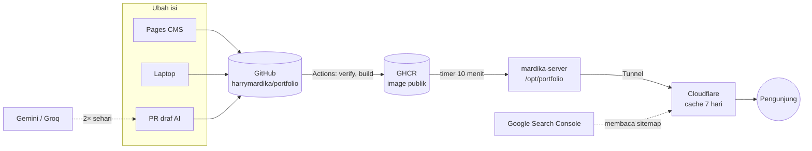

# 10 · Panduan operasional (untuk pemilik)

> Dokumen ini untuk **menjalankan** situs setelah jadi: akun yang terlibat, pekerjaan rutin, perawatan berkala, mengatasi masalah, dan pemulihan. Cara membangun dan memasang ada di [07 Deployment](07-deployment.md); cara mengubah isi ada di [04 Panduan konten](04-content-guide.md).
>
> **Tidak ada nilai secret di dokumen ini**, hanya nama, tempat, dan cara menggantinya.

## 1. Peta sistem



| Layanan | Fungsi di proyek ini | Jika bermasalah |
|---|---|---|
| **GitHub** (repo `harrymardika/portfolio`, publik) | Sumber kode dan isi; menjalankan semua workflow | Situs tetap tayang versi terakhir; tidak ada update |
| **GitHub Actions** | `CI` (PR), `Deploy` (push ke `main`, tiap 6 jam, manual), `Case study drafts` (dua kali sehari, manual), `Assistant eval` (manual, [docs/assistant-eval.md](assistant-eval.md)) | Lihat §5.1 |
| **GHCR** (`portfolio-web`, `portfolio-stats`, `portfolio-assistant`, publik) | Menyimpan image; server menariknya tanpa login | Server tetap menjalankan image yang sudah ada |
| **mardika-server** (laptop Debian 13 di rumah) | Menjalankan Caddy + stats + chatbot di `/opt/portfolio`; diakses lewat Tailscale | Lihat §5.2; Cloudflare masih menyajikan salinan |
| **Cloudflare** (zona `mardika.my.id`) | DNS, Tunnel, cache HTML 7 hari, HTTPS | Situs tidak bisa dibuka sama sekali |
| **Pages CMS** (app.pagescms.org) | Editor isi di browser; menyimpan langsung ke `main` | Edit lewat GitHub web atau laptop |
| **Google AI Studio** (Gemini) dan **Groq** | Menulis draf studi kasus dari README; menjawab chatbot "Tanya Harry" (key terpisah, §3.1) | Draf tidak muncul / chatbot menampilkan tautan CV dan email; situs tidak terpengaruh |
| **Google Search Console** (properti `harry.mardika.my.id`) | Memantau indeks Google; sitemap terdaftar | Tidak berpengaruh ke situs |

## 2. Akun dan secret

Simpan semua nilai di password manager. Bila satu bocor: §6.4.

| Nama | Disimpan di | Fungsi | Cara mengganti |
|---|---|---|---|
| `GITHUB_TOKEN` | Otomatis di GitHub Actions | Push image ke GHCR, membaca API GitHub, membuat PR draf | Tidak perlu; dibuat ulang tiap run |
| `DRAFT_GEMINI_API_KEY` | GitHub → repo → *Settings → Secrets and variables → Actions* | Draf AI (pilihan pertama) | aistudio.google.com → *API keys* → buat baru, hapus yang lama → perbarui secret |
| `DRAFT_GROQ_API_KEY` | Sama dengan di atas | Draf AI (cadangan) | console.groq.com → *API Keys* → buat baru, hapus yang lama → perbarui secret |
| `ASSISTANT_GEMINI_API_KEY`, `ASSISTANT_GROQ_API_KEY` | `/opt/portfolio/.env` di server **dan** secret repo GitHub (untuk workflow eval) | Chatbot (Gemini Flash Lite utama, Groq cadangan; ADR 0015); **berbeda** dari key draf AI | Seperti key draf AI, tetapi di project AI Studio dan key Groq tersendiri → perbarui `.env` → `docker compose up -d assistant`, lalu perbarui juga secret GitHub dengan nama yang sama |
| `ASSISTANT_ENABLED` | `/opt/portfolio/.env` di server | Kill switch chatbot (`true`/`false`; kosong = mati) | Ubah nilainya → `docker compose up -d assistant` (tanpa build) |
| `PUBLIC_ASSISTANT_ENABLED` (variabel, bukan secret) | GitHub → repo → *Settings → Secrets and variables → Actions → Variables* | Ikut-tidaknya widget chatbot di-build (§3.1 langkah 6) | Ubah nilainya → jalankan Deploy |
| `MESSAGES_ADMIN_TOKEN` | `/opt/portfolio/.env` di server **dan** secret repo GitHub | Membuka antrean kesan & pesan untuk halaman tinjau dan workflow (§3.2); kosong = formulir tertutup | `openssl rand -hex 32` → tulis di `.env` server dan secret GitHub dengan nama sama → `docker compose up -d stats` |
| `STATS_ADMIN_TOKEN` | `/opt/portfolio/.env` di server **dan** `.env` di laptop | Membuka laporan link pelacak (`bun run stats:report`) | `openssl rand -hex 32` → tulis di kedua `.env` → di server `docker compose up -d` |
| `CF_API_TOKEN`, `CF_ZONE_ID` | `/opt/portfolio/.env` di server | Menghapus cache Cloudflare setelah deploy (ADR 0012) | Cloudflare → *My Profile → API Tokens* → token `portfolio-cache-purge` → *Roll* → perbarui `.env` |
| Token Cloudflare Tunnel | Konfigurasi `cloudflared` di server | Menghubungkan server ke Cloudflare | Cloudflare → *Zero Trust → Networks → Tunnels* |
| Akses Pages CMS | Izin aplikasi GitHub | Menyimpan commit atas nama Anda | GitHub → *Settings → Applications* (cabut jika tidak dipakai) |
| Rekaman TXT verifikasi Google | DNS zona `mardika.my.id` | Bukti kepemilikan untuk Search Console | **Jangan dihapus**; verifikasi akan hilang |

Catatan:
- Nama key sama di setiap tempat (ADR 0015): `ASSISTANT_*` hanya dipakai chatbot, `DRAFT_*` hanya dipakai draf AI. Key dipisah agar kuota dan kebocoran satu fitur tidak mengganggu fitur lain. `DRAFT_*` hanya dibutuhkan di GitHub; di `/opt/portfolio/.env` server key itu tidak dipakai, jadi lebih aman dihapus dari sana (bila server bocor, key draf tidak ikut terbuka). Saat merotasi key, perbarui setiap tempat yang menyimpannya.
- Pengaturan GitHub yang wajib tetap aktif: *Settings → Actions → General → Allow GitHub Actions to create and approve pull requests* (untuk PR draf AI).
- Halaman Cloudflare yang dipakai: Cache Rule `portfolio-html-cache`, *Browser Cache TTL: Respect Existing Headers*, *Always Online* (docs/07 §4).

## 3. Pekerjaan rutin

| Tugas | Cara | Tayang |
|---|---|---|
| Mengubah teks, pengalaman, sertifikat, terjemahan | Pages CMS → *Save* ([docs/04 §1](04-content-guide.md)) | ±20 menit |
| Menambah proyek dari GitHub | Beri repo topic `portfolio` (repo harus publik, README jelas) | Kartu: ≤ 6 jam (jadwal Deploy). Draf studi kasus: PR pada jadwal berikutnya (09:41 atau 21:41 WIB) |
| Meninjau draf studi kasus AI | Tab *Pull requests* → label `ai-draft` → periksa checklist → **Merge** (= tayang) | ±20 menit setelah merge |
| Menolak draf AI | Tolak permanen: *Close* saja, **branch dibiarkan** (repo itu tidak dibuatkan draf lagi). Ingin draf baru: *Close* lalu *Delete branch* | – |
| Membuat draf sekarang, tanpa menunggu jadwal | *Actions → Case study drafts → Run workflow* | – |
| Memperbarui situs sekarang | *Actions → Deploy → Run workflow* (mis. setelah mengubah deskripsi atau topic repo di GitHub) | ±20 menit |
| Melihat statistik | `/stats/` atau tautan *Site statistics* di footer ([docs/08](08-analytics.md)) | – |
| Link pelacak lamaran kerja | Buat link `?ref=…`; hasilnya lewat `bun run stats:report` di laptop ([docs/08 §4](08-analytics.md)) | – |

Jadwal otomatis (UTC; WIB = UTC+7):
- `Deploy`: menit 17 setiap 6 jam (00:17, 06:17, 12:17, 18:17 UTC): sinkron GitHub, PDF baru, sertifikat kedaluwarsa disembunyikan.
- `Case study drafts`: 02:41 dan 14:41 UTC (09:41 dan 21:41 WIB) setiap hari, maksimal 2 repo per run.
- Server: `portfolio-update.timer` tiap 10 menit; backup statistik 03:30 (jam server) setiap hari, 14 salinan terakhir di `/opt/portfolio/backups/`.

Jadwal GitHub bersifat *best-effort*: run terjadwal bisa terlambat berjam-jam atau dilewati saat GitHub sibuk (contoh: run draf pertama 2026-10-08 09:41 WIB tidak pernah dibuat, dan beberapa jadwal `Deploy` juga terlewat). Karena itu draf punya dua jadwal per hari. Jika tidak bisa menunggu, jalankan manual (*Run workflow*).

### 3.1 Chatbot "Tanya Harry" (Fase 11, ADR 0014)

Layanan `assistant` menjawab pertanyaan pengunjung dari isi situs. **Mati sampai Anda menyalakannya** (`ASSISTANT_ENABLED=true`); saat mati atau gagal, widget menampilkan tautan CV dan email.

**Memasang pertama kali (urutan penting):**
1. Tunggu deploy yang membawa layanan ini selesai, lalu github.com/harrymardika → *Packages* → `portfolio-assistant` → *Package settings* → *Change visibility* → **Public**. Jika langkah ini dilewati, `update.sh` gagal menarik image dan **seluruh update situs berhenti**.
2. Buat key baru khusus chatbot: project baru di aistudio.google.com (*API keys*) dan key baru di console.groq.com. Jangan memakai key draf AI. Simpan juga keduanya sebagai secret repo GitHub dengan nama yang sama (untuk workflow eval). **Pastikan project AI Studio itu tanpa billing** (tier gratis): kuota gratis Gemini adalah batas keras biaya, karena batas harian chatbot ikut direset setiap deploy (lihat *Kuota* di bawah).
3. Di server: salin `docker/compose.yml` dan `docker/deploy/update.sh` terbaru ke `/opt/portfolio/` (`update.sh` tidak memperbarui compose; compose versi T11.3 masih memakai pemetaan key lama sehingga chatbot tidak mendapat key), lalu pastikan `/opt/portfolio/.env` berisi:
   ```
   ASSISTANT_ENABLED=false
   ASSISTANT_GEMINI_API_KEY=<key Google AI Studio>
   ASSISTANT_GROQ_API_KEY=<key Groq>
   ```
4. `cd /opt/portfolio && ./update.sh`, lalu cek `curl -s http://127.0.0.1:8080/api/ask/health` → `{"ok":true,"enabled":false}`.
5. Setelah uji kualitas (T11.5) lulus: ubah `ASSISTANT_ENABLED=true`, jalankan `cd /opt/portfolio && docker compose up -d assistant`; health menjadi `"enabled":true`.
6. Tampilkan tombolnya di situs: GitHub → repo → *Settings → Secrets and variables → Actions → Variables* → **New repository variable** `PUBLIC_ASSISTANT_ENABLED` = `true`, lalu *Actions → Deploy → Run workflow*. Sebelum variabel ini ada, widget tidak ikut di-build sama sekali (tanpa layanan, pengecekan health-nya akan memunculkan error di konsol browser). Setelahnya, kill switch di langkah berikut tetap menyembunyikan tombol tanpa build ulang.

**Mematikan cepat (kill switch):** ubah `ASSISTANT_ENABLED=false` di `/opt/portfolio/.env` → `cd /opt/portfolio && docker compose up -d assistant`. Tidak perlu build: tombol chatbot tidak muncul lagi untuk pengunjung baru (yang sudah membuka panel di tab yang sama mendapat tautan CV dan email). Menghapus fitur sepenuhnya dari situs: ubah variabel repo `PUBLIC_ASSISTANT_ENABLED` menjadi `false` dan jalankan Deploy.

**Kuota dan batas:** per pengunjung 10 pertanyaan/jam dan 30/hari, seluruh situs 300/hari, maksimal 3 sekaligus. Hitungannya di memori, jadi **direset tengah malam UTC dan setiap kali container dibuat ulang**: setiap deploy (±4×/hari karena jadwal 6 jam) dan setiap kill switch diubah. Dalam praktik "300/hari" berarti 300 per periode antar-deploy; batas biaya yang sebenarnya adalah kuota gratis project AI Studio tanpa billing (langkah 2). Pemakaian kuota terlihat di AI Studio (*Usage*) dan console.groq.com (*Usage*). Gemini 3.5 Flash Lite (tier gratis, dicek 2026-10-09): 15 permintaan/menit, 500/hari. Groq hanya cadangan: ±35 jawaban/hari (8 ribu token/menit, 200 ribu/hari). Lihat ADR 0015.

**Log:** `docker compose logs --tail 50 assistant` berisi status, penyedia, dan alasan gagal, **tanpa teks pertanyaan**. Contoh: `"status":503,"failures":["Gemini: Gemini responded with HTTP 429 (RESOURCE_EXHAUSTED, GenerateRequestsPerDayPerProjectPerModel-FreeTier)",…]` berarti kuota harian habis (`…PerMinute…` = batas per menit, biasanya pulih sendiri).

### 3.2 Kesan & pesan dari formulir (Fase 12, ADR 0017)

Pengunjung bisa meninggalkan pesan untuk Anda. **Tidak ada yang tampil sebelum Anda setujui.** Pesan disimpan di server (`messages.sqlite` di volume stats, tidak ikut backup) hanya sampai Anda memutuskan: yang ditolak langsung dihapus, yang disetujui dihapus setelah PR-nya dibuka (paling lambat 30 hari bila PR tidak pernah terbuka), dan yang tidak ditinjau dihapus otomatis setelah 90 hari. Tidak ada IP maupun email penulis yang disimpan.

**Memasang (sekali):**
1. `openssl rand -hex 32` → simpan di password manager.
2. Di server: salin `docker/compose.yml` terbaru ke `/opt/portfolio/` (`update.sh` tidak memperbaruinya), tambahkan `MESSAGES_ADMIN_TOKEN=<token>` ke `/opt/portfolio/.env`, lalu `cd /opt/portfolio && docker compose up -d stats`. Log stats menulis `kind words form open`.
3. GitHub → repo → *Settings → Secrets and variables → Actions* → secret `MESSAGES_ADMIN_TOKEN` dengan nilai yang sama (untuk workflow PR dan notifikasi, T12.4).

**Menutup formulir sementara:** kosongkan `MESSAGES_ADMIN_TOKEN` di `.env` server → `docker compose up -d stats`. Kiriman baru ditolak dengan sopan, dan antrean yang ada tetap tersimpan.

**Penulis minta pesannya dihapus:** sebelum diputuskan, tolak di halaman tinjau. Bila sudah disetujui, tutup PR-nya tanpa merge (salinan di server terhapus begitu PR dibuka) dan hapus branch-nya. Bila sudah tayang, hapus dari `content/messages.yaml` (CMS atau PR).

**Meninjau pesan (bisa dari HP):** buka https://harry.mardika.my.id/messages/review/ (atau `/id/messages/review/`). Halaman ini tidak ditautkan di mana pun, `noindex`, dan tidak dihitung di statistik. Masukkan `MESSAGES_ADMIN_TOKEN` (salin dari password manager); token hanya diingat untuk tab itu. Setiap pesan tampil dengan nama, jabatan, hubungan, waktu kirim, bahasa, dan tautan profil (cek keasliannya di sana bila perlu):
- **Setujui** → PR yang menambahkannya ke `content/messages.yaml` dibuka dalam satu jam (T12.4); **merge PR itu = tayang**. Sebelum merge, Anda bisa menyunting teks atau terjemahannya di PR.
- **Tolak** → pesan langsung dihapus dari server.
- **Muat ulang antrean** untuk melihat pesan yang baru masuk; **Lupakan token** setelah selesai bila memakai perangkat orang lain.

Alamat halaman ini tercantum di `robots.txt` (agar tidak dirayapi), jadi siapa pun bisa tahu halamannya ada, tetapi tanpa token isinya kosong dan API menolak semua permintaan.

PR otomatis dan notifikasi harian menyusul di T12.4.

## 4. Perawatan berkala

**Bulanan (±15 menit)**
- [ ] GitHub → tab *Actions*: tidak ada run merah yang dibiarkan (§5.1).
- [ ] Buka situs dan `/stats/`: status online, angka statistik bergerak.
- [ ] Search Console: *Pages* (halaman terindeks) dan *Sitemaps* (status *Success*).
- [ ] Server lewat SSH (Tailscale):
  ```bash
  sudo apt update && sudo apt upgrade        # update keamanan Debian
  df -h / && docker system df               # ruang disk
  ls -lh /opt/portfolio/backups | tail -3   # backup terbaru = hari ini/kemarin (tanggal UTC)
  ```
- [ ] Salin satu backup statistik ke luar server (backup di disk yang sama tidak menolong jika SSD rusak):
  `scp <user>@<server>:/opt/portfolio/backups/stats-<tanggal>.sqlite ~/Backups/`

**Per kuartal (±1 jam, di laptop, satu branch)**
- [ ] Dependency: `bun outdated`, lalu `bun update` → `bun run verify`. Major version (Astro, Three.js, Tailwind) dikerjakan sebagai tugas tersendiri; baca catatan rilisnya.
- [ ] Versi image di `docker/Dockerfile` (`BUN_VERSION`, `NODE_VERSION`, `CADDY_VERSION`) dan `bun-version` di `.github/workflows/ci.yml` + `case-study-drafts.yml` (naikkan bersamaan), serta action di `.github/workflows/` (yang di-pin ke SHA di `case-study-drafts.yml`).
- [ ] Model AI masih tersedia: `GEMINI_MODEL`/`ASSISTANT_GEMINI_MODEL`/`GROQ_MODEL` di `src/lib/ai/providers.ts` (ADR 0013, 0015). Cek log run *Case study drafts* terakhir.
- [ ] Kesehatan baterai/daya laptop server (situs pernah mati karena daya terputus atau hang; penyebab pasti tidak diketahui).

**Tanggal penting**
- **2026-11:** sertifikat Alibaba Cloud Associate kedaluwarsa. Ia otomatis hilang dari situs dan CV pada build pertama Desember 2026 (sertifikat tampil selama bulan `expires` belum lewat). Jika diperpanjang, ubah `issued`/`expires` di Pages CMS (*Certifications*).
- Perpanjangan domain `mardika.my.id` di registrar: catat tanggalnya di kalender.

## 5. Mengatasi masalah

### 5.1 Deploy merah (✗ di commit atau tab *Actions*)
Situs **tetap tayang versi terakhir yang lolos**; tidak ada yang rusak di produksi.
1. Buka run yang merah → job yang gagal → langkah yang gagal.
2. Sesuai langkahnya:
   - **Verify (check, unit, e2e)** dengan pesan seperti `experience → … data does not match collection schema` (astro check) atau `experience.yaml[2] → end: …` (unit test): data dari CMS tidak valid. Pesannya menyebut file, item, dan field. Perbaiki lewat Pages CMS.
   - **Verify**, tes e2e: lihat artifact `playwright-report` di halaman run. Jika gagal setelah perubahan isi, kemungkinan tes masih menganggap isi lama; ini bug tes, perbaiki tesnya (jangan dihapus).
   - **Lighthouse**: ringkasan per halaman muncul sebagai anotasi di halaman run. Penyebab umum: gambar baru terlalu besar (pakai WebP dan perkecil ukurannya, seperti gambar di `content/media/projects/`). Mesin GitHub kadang lambat; coba *Re-run failed jobs* sekali sebelum mengubah apa pun.
   - **publish (web)** / **publish (stats)**: biasanya gangguan GitHub/GHCR sementara → *Re-run*.

### 5.2 Situs tidak bisa dibuka (Cloudflare error 1033/502/504)
1033 = Tunnel putus (server mati, tidak ada internet, atau `cloudflared` berhenti). 502/504 = Tunnel hidup tetapi Caddy tidak menjawab. Halaman yang sudah ada di cache Cloudflare tetap tersaji hingga 7 hari.
```bash
# Nyalakan laptop server, lalu SSH lewat Tailscale
systemctl status cloudflared                   # Tunnel
cd /opt/portfolio && docker compose ps         # web dan stats harus "healthy"
curl -s http://127.0.0.1:8080/api/health       # → {"ok":true}
docker compose logs --tail 50 web stats        # jika ada yang tidak sehat
docker compose up -d                           # menyalakan ulang yang mati
```

### 5.3 Perubahan tidak muncul
Urutannya: Actions *Deploy* (±10–15 menit) → timer server (≤ 10 menit) → hapus cache Cloudflare.
1. Tab *Actions*: run *Deploy* untuk commit itu hijau? Jika merah: §5.1. Jika commit itu tidak punya tanda run sama sekali (mis. disimpan saat GitHub gangguan): *Run workflow* manual.
2. Di server:
   ```bash
   systemctl list-timers portfolio-update.timer      # timer aktif, jadwal berikutnya
   journalctl -u portfolio-update.service -n 30      # "web image changed", "purged Cloudflare cache"
   ```
   `Cloudflare cache purge failed` akan dicoba ulang otomatis 10 menit kemudian (file `.purge-pending`). Jika terus gagal, token kemungkinan dicabut/kedaluwarsa (§2). Sementara itu: Cloudflare → *Caching → Configuration → Purge Cache → Custom Purge → Hostname* `harry.mardika.my.id`.
3. Browser: muat ulang tanpa cache (Ctrl+Shift+R). PDF boleh di-cache browser hingga 1 jam.

### 5.4 Pages CMS
- **Tombol simpan error / tidak bisa masuk:** cek status GitHub, keluar lalu masuk lagi ke app.pagescms.org.
- **Tersimpan, tetapi deploy merah:** §5.1. Perbaiki field yang disebut, simpan lagi.
- **Field baru di `content/` tidak muncul di editor:** `.pages.yml` belum diperbarui. Tes `tests/unit/cms-config.test.ts` akan gagal di laptop jika keduanya tidak sejalan.

### 5.5 Draf studi kasus AI tidak muncul
Buka run *Case study drafts* terakhir; repo yang gagal dibuatkan draf (README terlalu pendek, semua model gagal, key tidak ada) muncul sebagai peringatan kuning (anotasi). Repo yang memang tidak memenuhi syarat di bawah tidak diberi peringatan; log hanya menulis jumlah repo yang perlu studi kasus. Daftar periksa:
- [ ] Repo **publik**, punya topic `portfolio`, tidak ada di `exclude` di `content/github.yaml`.
- [ ] Repo punya README yang menjelaskan proyeknya (kosong atau di bawah ±200 karakter dilewati).
- [ ] Belum ada studi kasus untuk repo itu (`links.repo` sama, atau nama file sama dengan nama repo dalam huruf kecil dan tanda hubung, mis. `My_Repo` → `my-repo.md`). Untuk grup di `content/github.yaml`: studi kasus yang menautkan repo anggota **mana pun** menutup seluruh grup, dan nama filenya mengikuti judul grup (ADR 0016).
- [ ] Tidak ada branch lama `drafts/case-study-<nama>` (PR yang ditutup tanpa menghapus branch). Untuk grup, nama branch-nya `drafts/case-study-<slug judul grup>`; branch lama milik salah satu anggota (dibuat sebelum ADR 0016) juga menahan grup itu.
- [ ] Sudah lewat jadwal 09:41 atau 21:41 WIB dan run-nya benar-benar ada di tab *Actions* (GitHub kadang melewatkan jadwal), atau jalankan manual. Maksimal 2 proyek per run.
- [ ] Secret `DRAFT_GEMINI_API_KEY`/`DRAFT_GROQ_API_KEY` ada, dan izin *Allow GitHub Actions to create and approve pull requests* aktif.

**Draf tanpa angka metrik:** angka hanya dipakai jika tertulis di README (pengaman terhadap angka karangan AI). Tulis hasil terukur di README repo, atau tambahkan metrik di PR/CMS.

### 5.6 Search Console: sitemap "Couldn't fetch"
Sering muncul sesaat setelah didaftarkan. Cek `curl -sI https://harry.mardika.my.id/sitemap.xml` (harus `200` dan `text/xml`), lalu *URL Inspection → Test live URL* untuk sitemap itu. Jika live test berhasil, tunggu beberapa hari; Google mengambil ulang sendiri.

### 5.7 Statistik kosong atau `/stats/` menulis "offline"
`/stats/` menulis "offline" jika `/api/health` gagal: server mati (§5.2) dan pengunjung melihat salinan Cloudflare. Jika situs hidup tetapi angka tidak bertambah: `cd /opt/portfolio && docker compose logs --tail 50 stats` di server.

### 5.8 Build gagal: "Assistant knowledge: …"
Setiap build menyusun pengetahuan chatbot dari isi situs (ADR 0014) dan berhenti jika ada yang tidak aman. Situs lama tetap tayang. Pesan dan cara memperbaikinya:
- **`… links to paths the build does not have: /…`**: sebuah bagian menunjuk halaman yang tidak ada (mis. studi kasus diganti nama). Biasanya perlu perbaikan kode di `src/lib/assistant/`; minta AI agent memperbaikinya.
- **`… contains something that looks like a phone number`**: ada teks di `content/` yang mirip nomor HP (`08…` atau `+62…`). Hapus atau ubah teks itu. Nomor HP tidak boleh tampil di situs.
- **`knowledge-compact.json is about N tokens, over the budget of 5000`**: isi situs sudah terlalu banyak untuk versi ringkas (penyedia cadangan Groq). Ini bisa terjadi setelah studi kasus baru di-merge, repo baru diberi topic `portfolio`, atau ringkasan diperpanjang. Jangan menaikkan batasnya; minta AI agent memindahkan teks panjang ke `detail` (hanya versi lengkap) di `src/lib/assistant/`. Log build sudah memperingatkan saat ukuran melewati 90%.
- **`knowledge.json … over the budget of 25000`**: sama, untuk versi lengkap (Gemini).

## 6. Pemulihan

### 6.1 Kembali ke versi sebelumnya
- **Isi salah** (paling sering): perbaiki lewat Pages CMS, atau di GitHub buka commit itu → *Revert*. Ini menghasilkan deploy baru seperti biasa.
- **Versi baru rusak padahal CI hijau:** kunci server ke image lama ([docs/07 §7](07-deployment.md)): tulis `TAG=sha-<commit lama>` di `/opt/portfolio/.env`, jalankan `./update.sh`. Daftar tag: GitHub → *Packages → portfolio-web*. Hapus baris `TAG` setelah perbaikan masuk `main`.

### 6.2 Memulihkan statistik dari backup
> Langkah ini sudah diuji dengan image `portfolio-stats` asli di stack uji terpisah, tetapi belum pernah dijalankan di server.
>
> **Penting:** `backup-stats.sh` menamai file dengan tanggal UTC hari ini dan menimpa file bernama sama. Karena itu backup yang akan dipulihkan disalin dulu ke `restore.sqlite`, dan kondisi sekarang disimpan sebagai `pre-restore-…` (nama ini tidak ikut dihapus rotasi 14 hari).
```bash
cd /opt/portfolio
cp backups/stats-<tanggal>.sqlite backups/restore.sqlite             # 1. amankan backup yang dipilih
sudo systemctl stop portfolio-update.timer                           # 2. timer tidak menyalakan stats di tengah jalan
./backup-stats.sh && mv "backups/stats-$(date -u +%F).sqlite" "backups/pre-restore-$(date -u +%F).sqlite"
docker compose stop stats
docker compose run --rm --no-deps -v "$PWD/backups:/b:ro" --entrypoint sh stats \
  -c 'rm -f /data/stats.sqlite-wal /data/stats.sqlite-shm && cp /b/restore.sqlite /data/stats.sqlite'
docker compose up -d --wait stats
sudo systemctl start portfolio-update.timer
```

### 6.3 Server rusak atau dipasang ulang
1. Pasang Debian, Docker (repo resmi Docker), Tailscale, dan `cloudflared` (Tunnel yang sama, atau buat baru lalu arahkan `harry.mardika.my.id` ke `http://localhost:8080`).
2. Ikuti [docs/07 §3](07-deployment.md): folder `/opt/portfolio`, `.env` (isi dari password manager), `docker compose up -d`, timer, cron backup. Pastikan `update.sh` dan `backup-stats.sh` bisa dieksekusi (`ls -l`; jika perlu `chmod +x`).
3. Salin backup statistik dari luar server ke `/opt/portfolio/backups/`, lalu pulihkan (§6.2).

Selama server mati, Cloudflare tetap menyajikan halaman yang ada di cache hingga 7 hari.

### 6.4 Key atau token bocor
(Misalnya tertempel di chat, di-commit, atau terlihat di screenshot.)
1. **Cabut dulu** di layanannya (§2), baru buat yang baru. Menghapus commit tidak cukup: repo ini publik dan riwayatnya mungkin sudah tersalin.
2. Simpan nilai baru di tempat yang sama (§2) dan di password manager.
3. Jika yang bocor `CF_API_TOKEN`: dampaknya terbatas pada penghapusan cache (izinnya hanya *Cache Purge*). Jika token Tunnel: buat ulang Tunnel-nya. Jika key chatbot (`ASSISTANT_*`): matikan dulu (`ASSISTANT_ENABLED=false`), cabut dan ganti key-nya, lalu nyalakan lagi; key draf AI tidak terdampak.

### 6.5 Laptop pengembangan hilang
Semua kode dan isi ada di GitHub. Yang **tidak** ada di GitHub: `.env` laptop (cukup `STATS_ADMIN_TOKEN`, ada di password manager) dan folder bahan mentah `CV/` (di-gitignore; simpan cadangannya sendiri).
