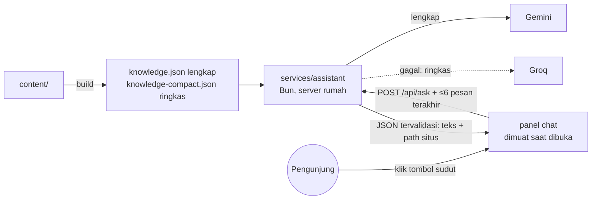

# 11 · Rencana lanjutan (Fase 9–13)

> Disusun 2026-10-07 setelah situs online dan Fase 0–8 selesai. Dokumen ini menjelaskan **apa** yang dibangun setelah peluncuran, **kenapa**, dan pilihan yang dulu diajukan ke pemilik. **Semua keputusan D8–D17 sudah diambil pemilik** (2026-10-07 dan 2026-10-08); keputusannya tercatat di awal tiap bagian dan di tabel [Keputusan](#keputusan) di bawah. Bila keputusan berbeda dari rekomendasi awal, yang berlaku adalah keputusannya. Daftar tugas yang bisa dicentang ada di [`PROGRESS.md`](../PROGRESS.md) (Fase 9–13).
>
> **Status (2026-10-09):** Fase 9–12 selesai (rilis 1.1.0–1.4.0); chatbot dan formulir kesan & pesan tayang 2026-10-09. Berikutnya Fase 13.
>
> Prinsip lama tetap berlaku: satu sumber data (`content/`), situs tetap utuh tanpa JS dan saat server mati, tanpa secret di repo, tanpa skrip pihak ketiga tanpa ADR, dan teks buatan AI selalu ditinjau pemilik.

## Ringkasan

| Fase | Isi | Kenapa | Ukuran |
|---|---|---|---|
| 9 ✅ | **Personal branding & konten**: positioning, baris peran, skill lebih lengkap, terjemahan studi kasus, kesan & pesan (tampilan), format angka | Pondasi untuk fase lain; kebanyakan isi, sedikit kode | Kecil–sedang |
| 10 ✅ | **CV per posisi**: AI/ML, Data Engineer, Data Analyst, Product Manager, Project Manager, Management Trainee (versi khusus perusahaan batal, D10) | Satu CV umum kalah relevan di ATS dibanding CV yang menyorot hal yang dicari | Sedang |
| 11 ✅ | **Chatbot "Tanya Harry"** di sudut setiap halaman | Recruiter mendapat jawaban cepat; menunjukkan kemampuan LLM secara langsung | Besar (layanan baru, ADR) |
| 12 ✅ | **Formulir kesan & pesan** dengan moderasi | Bukti sosial dari orang lain tanpa membuka kolom komentar bebas | Sedang |
| 13 | **3D tambahan** di halaman selain beranda | Lebih banyak 3D sesuai tema tanpa memberatkan beranda | Sedang |

Urutan: 9 → 10 → 11 → 12 → 13. Fase 10 dan 11 sama-sama memakai hasil Fase 9 (positioning dan skill), jadi jangan dibalik. Fase 12 tidak lagi opsional (D15). Fase 13 dikerjakan setelah Fase 11 dan 12 (D17). Setiap fase ditutup dengan tugas penutupan (`AGENTS.md` §2a).

---

## A. Personal branding: AI Engineer, Product, Data, atau semuanya?

**Keputusan (D8, D9, 2026-10-07):** baris peran **AI Product Manager**; positioning AI Product Manager dengan kemampuan AI engineering sebagai pembeda (suara produk lebih dulu). Ini menggantikan rekomendasi "AI Engineer" di bawah. Dikerjakan di T9.1.

**Masalahnya.** Pemilik bisa di beberapa jalur: AI Engineer, Product/Project Manager, Data Engineer, Data Analyst. Kalau situs mengaku semuanya sejajar ("AI Engineer | PM | Data Engineer | Analyst"), pembaca tidak tahu Anda ahli di mana, dan setiap jalur terlihat setengah-setengah.

**Rekomendasi: satu identitas utama + kekuatan pendukung (bentuk "T").**
- **Identitas utama di website: AI Engineer.** Bukti terkuat ada di sini (riset hibah, edge AI, computer vision real-time, mengajar ML ke 75+ peserta).
- **Pembeda: "yang membangun produk sampai jadi"**, bukan hanya model. Bukti: Decklify (peluncuran komersial 3 bulan, NPS +45, model bisnis), Dompet Juara, portfolio ini sendiri. Inilah jembatan ke Product/Project.
- **Data Engineering/Analyst sebagai kemampuan pendukung**: Netflix data warehouse + ETL, forecasting saham, analisis. Tampil di skill dan proyek, tidak di judul.
- **Penargetan per posisi dilakukan oleh CV (Fase 10), bukan oleh website.** Website = etalase umum yang konsisten; CV = surat yang disesuaikan untuk tiap lamaran. Ini juga cara kebanyakan profesional menangani beberapa jalur.

Contoh hasilnya:

| Tempat | Sekarang | Usulan |
|---|---|---|
| Baris peran (hero, CV umum, sampul Portfolio, JSON-LD `jobTitle`) | AI Engineer · Founder, Decklify | **AI Engineer** atau **AI Engineer · AI products, end to end** |
| Tagline | I turn video, speech, and text into AI products people can actually use… | Tetap (sudah menyiratkan produk) |
| Ringkasan | … | Ditinjau ulang setelah D8: satu kalimat produk/data ditambahkan |

**Tentang "AI Engineer · Founder, Decklify" (pertanyaan pemilik): sebaiknya diubah.** Baris itu dibaca pertama kali oleh recruiter. "Founder" di posisi paling atas bisa ditangkap sebagai "sedang sibuk dengan startup sendiri, mungkin tidak bisa full-time", dan nama Decklify belum dikenal. Decklify tetap tampil kuat di Pengalaman, Journey, dan Projects. Baris itu juga dipakai di CV dan JSON-LD, jadi CV per posisi (Fase 10) nanti punya baris perannya sendiri.

Pilihan yang dulu diajukan untuk D8: (a) "AI Engineer", (b) "AI Engineer · AI products, end to end", (c) tulisan Anda sendiri.

## B. CV per posisi (dan per perusahaan?)

**Keputusan (D10, 2026-10-07 dan 2026-10-08):** 6 varian (Product dan Project Manager terpisah), PDF dibuat saat deploy di `/downloads/cv/`, didaftar di halaman `/cv/` yang ditautkan di footer (noindex). **CV per perusahaan tidak dibuat** (poin 4 batal). CV umum memakai baris peran AI Product Manager (D8).

**Rekomendasi: varian per posisi dari data yang sama; versi per perusahaan hanya privat.**

1. **Satu CV umum** tetap di website (versi AI Engineer), seperti sekarang.
2. **Varian per posisi**, didefinisikan di `content/cv-variants.yaml`. Setiap varian hanya **memilih dan mengurutkan**, tidak mengarang:
   - baris peran dan ringkasan sendiri (EN + ID);
   - urutan bagian (mis. Product: Pengalaman Decklify di atas; Data Engineer: Skill data dulu);
   - poin mana yang tampil: setiap poin di `highlights` diberi label fokus (`ai`, `data`, `product`, `leadership`), lalu varian memilih label yang relevan;
   - grup skill dan urutannya.
3. **Varian awal yang diusulkan:** AI/ML Engineer (umum), Data Engineer, Data Analyst, Product Manager / Project Manager, Management Trainee. Mana yang dibuat dan apakah publik: **D10**.
4. **Per perusahaan:** cukup baris "ringkasan" yang disesuaikan + nama file (mis. `Harry-Mardika-CV-Data-Engineer-PT-X.pdf`), dibuat **di laptop** dengan `bun run cv --variant data-engineer --company "PT X"`, **tidak pernah di-upload ke situs atau repo** (nama perusahaan yang dilamar bersifat pribadi). Kombinasikan dengan link pelacak `?ref=` yang sudah ada (docs/08 §4).
5. **Nanti (opsional):** dari teks lowongan, AI menyarankan varian, poin yang ditonjolkan, dan kata kunci yang belum ada di CV; pemilik memutuskan. Tetap tanpa mengarang pengalaman.

Batas yang dijaga: maksimal 2 halaman per varian (dites), ATS-friendly, tanpa nomor HP, semua angka dari `content/`.

## C. Skill lebih lengkap

**Keputusan (D11, 2026-10-08):** semua kandidat dikonfirmasi satu per satu oleh pemilik; `skills.yaml` menjadi 8 grup, dan grup yang tidak muat di CV umum ditandai `show_on_cv: false` (T9.2).

**Masalahnya.** `content/skills.yaml` hanya 5 grup dan ±25 item; banyak yang sudah terbukti di proyek belum tercantum (mis. Python, SQL, LangChain, OpenCV, Streamlit, Prometheus/Grafana), dan pemilik menyebut GCP dan LangChain.

**Rekomendasi:**
- **Aturan emas: hanya skill yang sanggup Anda jelaskan saat wawancara.** Recruiter teknis sering menanyakan satu skill acak dari CV.
- Grup baru yang lebih mudah dipindai ATS: *AI & ML* · *LLM & Generative AI* · *Data* · *Cloud & MLOps* · *Web & produk* · *Produk & manajemen* · *Kepemimpinan* · *Bahasa*.
- Daftar kandidat disusun dari bukti yang sudah ada di `content/` (tag proyek/pengalaman) + yang disebut pemilik; **pemilik mencentang** mana yang dipakai (D11). Kandidat yang perlu konfirmasi karena belum ada buktinya di repo: GCP (layanan apa: Vertex AI, BigQuery, Cloud Run?), LangChain, SQL, Pandas/NumPy, scikit-learn, Airflow, Spark, Power BI/Tableau/Looker, Figma, Jira/Notion, Scrum/Agile, Git/Linux.
- Di website semua tampil per grup; di CV tiap varian menampilkan grup yang relevan (Fase 10). Tanpa "bar persentase" (tidak ramah ATS, sudah dilarang docs/09).

## D. Studi kasus berbahasa Indonesia

**Keputusan (D12, 2026-10-07): pilihan (c)**, semua 11 studi kasus diterjemahkan; istilah teknis/asing tetap bahasa Inggris. Selesai dan ditinjau pemilik 2026-10-08 (T9.3).

Ringkasan, peran, dan angka sudah dwibahasa; isi Problem/Approach/Result hanya bahasa Inggris dengan catatan. Pilihan (**D12**):
- **(a) Rekomendasi:** catatan diganti menjadi "Ringkasan di atas dalam bahasa Indonesia; detail teknis ditulis dalam bahasa Inggris." (1 baris teks UI).
- **(b)** Dukungan terjemahan body `content/projects/id/<slug>.md` dengan fallback ke Inggris, lalu terjemahkan hanya Decklify dan Dompet Juara dulu. Termasuk: menu CMS baru, Portfolio PDF ID memakai terjemahan, tes kesamaan struktur (judul bagian dan gambar) agar dua versi tidak melenceng.
- **(c)** Seperti (b) untuk semua 11 studi kasus (±2.000 kata; draf oleh AI, ditinjau pemilik). Biaya: setiap edit dikerjakan dua kali.

## E. Chatbot "Tanya Harry" di sudut (Fase 11, D13, D14)

**Keputusan (2026-10-08):** chatbot mengambang di sudut kanan bawah setiap halaman (D13); Gemini utama, Groq cadangan, teks pertanyaan tidak disimpan (D14). Pratinjau: https://claude.ai/artifact/9bHCrGGLHm7t1BJoh2fV7a.

**Hasil (2026-10-09, ✅):** tayang dengan `gemini-3.5-flash-lite` (kuota gratis 500/hari; `gemini-3.5-flash` hanya 20/hari) dan key `ASSISTANT_*` tersendiri (ADR 0015); eval 30/30 (`docs/assistant-eval.md`); pemberitahuan privasi dilipat di balik tautan "Privacy". Rencana di bawah dipertahankan sebagai catatan desain.

**Tujuannya.** Pengunjung (terutama recruiter) bertanya dalam bahasa sehari-hari: "Pernah pakai YOLO di produksi?", "Apa peran Harry di Decklify?". Jawaban singkat dari isi situs, dengan tautan ke halaman terkait.

- **Layanan terpisah** `services/assistant` (image sendiri, 128 MB, read-only, tanpa volume): key AI hanya ada di sini; gangguan AI tidak memengaruhi statistik.
- **Pengetahuan = isi situs saja**, dibuat saat build (T11.1, [ADR 0014](adr/0014-ask-harry-assistant.md)). Dua ukuran: lengkap (EN+ID dengan isi studi kasus, ±16 ribu token, Gemini) dan ringkas (EN tanpa detail, ±4,1 ribu dari batas 5 ribu token, Groq; model gpt-oss di Groq dibatasi 8 ribu token/menit). Tanpa vector DB.
- **Tanpa penyimpanan:** browser mengirim maksimal 6 pesan terakhir setiap bertanya; percakapan hanya di `sessionStorage` tab itu. Server mencatat jumlah, bukan teks.
- **Batas:** 1–500 karakter per pertanyaan; 10/jam dan 30/hari per pengunjung (hash harian, tanpa IP); 300/hari total; ≤ 3 permintaan bersamaan; timeout 20 s.
- **Pengaman jawaban:** prompt membatasi topik dan menolak data pribadi; jawaban JSON divalidasi (teks biasa, tautan hanya path situs yang ada, pola nomor HP ditolak); kill switch `ASSISTANT_ENABLED`.
- **Widget:** tombol kecil di semua halaman (bukan halaman cetak), tersembunyi tanpa JS; panel dimuat saat diklik sehingga Lighthouse tidak turun; dialog ramah keyboard/pembaca layar; lembar bawah di HP; saat server mati atau batas habis menampilkan tautan CV dan email; pemberitahuan privasi (Gemini tier gratis boleh memakai isi permintaan untuk memperbaiki produknya).
- **Uji:** ±30 pertanyaan (fakta, di luar topik, data pribadi, prompt injection) lewat workflow manual dengan secret repo; hasil dicatat sebelum fitur dinyalakan.
- **Biaya:** gratis dalam kuota tier gratis; batas harian mencegah kuota habis.

## F. Komentar atau testimoni dari orang lain

**Keputusan (D15, 2026-10-07):** langsung dengan formulir bermoderasi (Fase 12 tidak opsional); tidak ada yang tampil sebelum disetujui pemilik.

> **Hasil (2026-10-09, ✅):** formulir `/messages/` (tanpa email penulis), antrean privat di layanan stats, halaman tinjau ber-token, satu PR antrean dengan terjemahan AI, notifikasi harian lewat issue berisi jumlah saja (ADR 0017). Diuji live ujung ke ujung. Turnstile belum diperlukan.

> **Pembaruan 2026-10-08:** atas permintaan pemilik, istilahnya menjadi **kesan & pesan** ("Kind words"): pesan yang ditinggalkan orang lain untuk pemilik. Tahap 1 sudah dibangun di `content/messages.yaml` (T9.4), bukan `testimonials.yaml`; Portfolio PDF belum memuatnya. Rancangan di bawah tetap berlaku dengan nama baru.

**Rekomendasi: bukan kolom komentar bebas, melainkan testimoni yang dikurasi.** Kolom komentar terbuka di portfolio mengundang spam dan pesan yang tidak relevan, butuh moderasi setiap hari, dan satu komentar buruk tampil di depan recruiter. Yang memberi nilai adalah **rekomendasi dari orang yang pernah bekerja dengan Anda**.

- **Tahap 1 (Fase 9, statis):** `content/testimonials.yaml`: nama, peran, hubungan ("atasan di …", "peserta bootcamp"), kutipan EN/ID, tautan LinkedIn opsional, **tanggal persetujuan**. Tampil 2–4 testimoni di beranda/About, dan opsional di Portfolio PDF. Sumber: rekomendasi LinkedIn, pesan dari peserta/mentor, dengan izin orangnya.
- **Tahap 2 (Fase 12):** formulir "Tulis testimoni" → tersimpan sebagai **antrean moderasi** (SQLite di server, tidak pernah tampil otomatis) → pemilik meninjau (perintah `bun run testimonials` atau halaman privat ber-token) → yang disetujui masuk `testimonials.yaml` lewat Pull Request. Anti-spam: honeypot + batas per IP; Cloudflare Turnstile hanya jika perlu (skrip pihak ketiga, butuh ADR + perubahan CSP).
- Keputusan: **D15**.

---

## G. Format angka yang konsisten

Pemilik meminta penulisan angka desimal konsisten di semua tempat (IPK, akurasi, persentase). Saat ini halaman Indonesia mengikuti aturan baku PUEBI (koma desimal: `3,99`, `92,5%`; titik ribuan: `12.000`), sedangkan halaman Inggris memakai titik desimal.

**Keputusan (D16, 2026-10-08): ikuti aturan baku tiap bahasa.** Usulan awal "titik untuk semua" ditarik karena menyimpang dari PUEBI. Teks ditulis per bahasa; nilai yang ditulis sekali (angka hero, angka utama proyek, IPK) ditulis gaya Inggris dan diubah otomatis di halaman Indonesia. Dijaga tes (T9.5).

## H. 3D tambahan (Fase 13, D17)

Pemilik ingin lebih banyak 3D yang sesuai tema. Agar beranda (sudah dua scene, skor performa mepet) tetap ringan, 3D baru ditaruh di halaman lain: **peta proyek** (Projects; studi kasus sebagai titik di "ruang embedding" per bidang), **404 ala computer vision** (kotak deteksi mengunci "page · not found"), **rasi skill** (About), dan **globe pengunjung** (Statistik). Pratinjau interaktif disetujui pemilik pada 2026-10-08; dikerjakan setelah Fase 11 dan 12. Komponen bersama (putar, hover, label) dibangun di T13.1 dan dipakai ulang.

## Keputusan

Semua sudah diputuskan pemilik. Rekomendasi awal dan alasannya ada di bagian masing-masing di atas.

| No | Pertanyaan | Keputusan pemilik | Tugas |
|---|---|---|---|
| D8 | Baris peran (hero, CV umum, Portfolio, JSON-LD) | **AI Product Manager** (2026-10-07) | T9.1 |
| D9 | Positioning | **AI Product Manager dengan kemampuan AI engineering** (2026-10-07) | T9.1, Fase 10 |
| D10 | Varian CV mana, dan apakah ditaruh di website | **6 varian**, PDF di `/downloads/cv/`, halaman `/cv/` ditautkan di footer (noindex); tanpa CV per perusahaan (2026-10-07; varian dan `/cv/` 2026-10-08) | T10.x |
| D11 | Skill tambahan yang benar-benar dikuasai | **Semua kandidat**, dikonfirmasi satu per satu (2026-10-08) | T9.2 |
| D12 | Studi kasus bahasa Indonesia | **(c) Terjemahkan semua**, istilah teknis tetap bahasa Inggris (2026-10-07) | T9.3 |
| D13 | Asisten AI: lanjut dan letaknya | **Lanjut, chatbot di sudut kanan bawah** setiap halaman, bukan halaman cetak (2026-10-08) | Fase 11 |
| D14 | Asisten AI: penyedia dan penyimpanan | **Gemini utama, Groq cadangan**; teks pertanyaan tidak disimpan (2026-10-08) | T11.x |
| D15 | Kesan & pesan: statis saja, atau juga formulir | **Langsung dengan formulir bermoderasi** (2026-10-07) | T9.4, Fase 12 |
| D16 | Format angka | **Aturan baku tiap bahasa** (EN `92.5%`, ID `92,5%`) (2026-10-08) | T9.5 |
| D17 | 3D tambahan | **Keempatnya**, setelah Fase 11 dan 12, urutan Proyek → 404 → Skill → Globe (2026-10-08) | Fase 13 |
