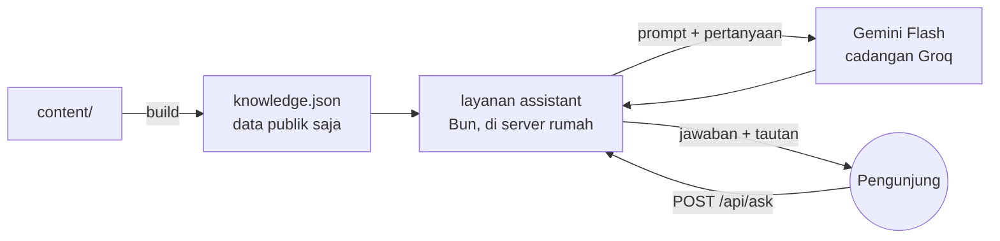

# 11 · Rencana lanjutan (Fase 9–12)

> Disusun 2026-10-07 setelah situs online dan Fase 0–8 selesai. **Sudah diputuskan pemilik (2026-10-07):** D8 = baris peran **AI Product Manager**; D9 = positioning AI Product Manager dengan kemampuan AI engineering (menggantikan rekomendasi §A di bawah); D10 = 6 varian (Product dan Project Manager terpisah), PDF varian didaftar di `/cv/` dan ditautkan di footer (2026-10-08), **tanpa CV per perusahaan** (§B poin 4 batal); D12 = terjemahkan semua studi kasus, istilah teknis tetap bahasa Inggris; D15 = langsung dengan formulir bermoderasi. Dokumen ini menjelaskan **apa** yang akan dibangun berikutnya, **kenapa**, dan **keputusan apa** yang perlu diambil pemilik sebelum tugasnya dikerjakan. Daftar tugas yang bisa dicentang ada di [`PROGRESS.md`](../PROGRESS.md) (Fase 9–12); keputusan yang belum diambil ditandai **D8–D15** di sana.
>
> Prinsip lama tetap berlaku: satu sumber data (`content/`), situs tetap utuh tanpa JS dan saat server mati, tanpa secret di repo, tanpa skrip pihak ketiga tanpa ADR, dan teks buatan AI selalu ditinjau pemilik.

## Ringkasan

| Fase | Isi | Kenapa | Ukuran |
|---|---|---|---|
| 9 | **Personal branding & konten**: positioning, baris peran, skill lebih lengkap, catatan/terjemahan studi kasus, testimoni (statis) | Pondasi untuk fase lain; kebanyakan isi, sedikit kode | Kecil–sedang |
| 10 | **CV per posisi**: AI/ML, Data Engineer, Data Analyst, Product Manager, Project Manager, Management Trainee (versi khusus perusahaan batal, D10) | Satu CV umum kalah relevan di ATS dibanding CV yang menyorot hal yang dicari | Sedang |
| 11 | **Asisten AI "Tanya tentang Harry"** di situs | Recruiter mendapat jawaban cepat; menunjukkan kemampuan LLM/RAG secara langsung | Besar (layanan baru, ADR) |
| 12 | **Formulir testimoni** dengan moderasi (opsional) | Bukti sosial dari orang lain tanpa membuka kolom komentar bebas | Sedang |

Urutan disarankan 9 → 10 → 11 → 12. Fase 10 dan 11 sama-sama memakai hasil Fase 9 (positioning dan skill), jadi jangan dibalik. Fase 12 boleh dilewati.

---

## A. Personal branding: AI Engineer, Product, Data, atau semuanya?

**Masalahnya.** Pemilik bisa di beberapa jalur: AI Engineer, Product/Project Manager, Data Engineer, Data Analyst. Kalau situs mengaku semuanya sejajar ("AI Engineer | PM | Data Engineer | Analyst"), pembaca tidak tahu Anda ahli di mana, dan setiap jalur terlihat setengah-setengah.

**Rekomendasi: satu identitas utama + kekuatan pendukung (bentuk "T").**
- **Identitas utama di website: AI Engineer.** Bukti terkuat ada di sini (riset hibah, edge AI, computer vision real-time, mengajar ML ke 75+ peserta).
- **Pembeda: "yang membangun produk sampai jadi"**, bukan hanya model. Bukti: Decklify (peluncuran komersial 3 bulan, NPS +45, model bisnis), Dompet Juara, portfolio ini sendiri. Inilah jembatan ke Product/Project.
- **Data Engineering/Analyst sebagai kemampuan pendukung**: Netflix data warehouse + ETL, forecasting saham, analisis. Tampil di skill dan proyek, tidak di judul.
- **Penargetan per posisi dilakukan oleh CV (Fase 10), bukan oleh website.** Website = etalase umum yang konsisten; CV = surat yang disesuaikan untuk tiap lamaran. Ini juga cara kebanyakan profesional menangani beberapa jalur.

Contoh hasilnya:

| Tempat | Sekarang | Usulan |
|---|---|---|
| Baris peran (hero, CV umum, sampul Portfolio, JSON-LD `jobTitle`) | AI Engineer · Founder, Decklify | **AI Engineer** atau **AI Engineer · AI products, end to end** |
| Tagline | I turn video, speech, and text into AI products people can actually use… | Tetap (sudah menyiratkan produk) |
| Ringkasan | … | Ditinjau ulang setelah D8: satu kalimat produk/data ditambahkan |

**Tentang "AI Engineer · Founder, Decklify" (pertanyaan pemilik): sebaiknya diubah.** Baris itu dibaca pertama kali oleh recruiter. "Founder" di posisi paling atas bisa ditangkap sebagai "sedang sibuk dengan startup sendiri, mungkin tidak bisa full-time", dan nama Decklify belum dikenal. Decklify tetap tampil kuat di Pengalaman, Journey, dan Projects. Baris itu juga dipakai di CV dan JSON-LD, jadi CV per posisi (Fase 10) nanti punya baris perannya sendiri.

**Keputusan D8**: pilih baris peran: (a) "AI Engineer", (b) "AI Engineer · AI products, end to end", (c) tulisan Anda sendiri.

## B. CV per posisi (dan per perusahaan?)

**Rekomendasi: varian per posisi dari data yang sama; versi per perusahaan hanya privat.**

1. **Satu CV umum** tetap di website (versi AI Engineer), seperti sekarang.
2. **Varian per posisi**, didefinisikan di `content/cv-variants.yaml`. Setiap varian hanya **memilih dan mengurutkan**, tidak mengarang:
   - baris peran dan ringkasan sendiri (EN + ID);
   - urutan bagian (mis. Product: Pengalaman Decklify di atas; Data Engineer: Skill data dulu);
   - poin mana yang tampil: setiap poin di `highlights` diberi label fokus (`ai`, `data`, `product`, `leadership`), lalu varian memilih label yang relevan;
   - grup skill dan urutannya.
3. **Varian awal yang diusulkan:** AI/ML Engineer (umum), Data Engineer, Data Analyst, Product Manager / Project Manager, Management Trainee. Mana yang dibuat dan apakah publik: **D10**.
4. **Per perusahaan:** cukup baris "ringkasan" yang disesuaikan + nama file (mis. `Harry-Mardika-CV-Data-Engineer-PT-X.pdf`), dibuat **di laptop** dengan `bun run cv --variant data-engineer --company "PT X"`, **tidak pernah di-upload ke situs atau repo** (nama perusahaan yang dilamar bersifat pribadi). Kombinasikan dengan link pelacak `?ref=` yang sudah ada (docs/08 §4).
5. **Nanti (opsional):** dari teks lowongan, AI menyarankan varian, poin yang ditonjolkan, dan kata kunci yang belum ada di CV; pemilik memutuskan. Tetap tanpa mengarang pengalaman.

Batas yang dijaga: maksimal 2 halaman per varian (dites), ATS-friendly, tanpa nomor HP, semua angka dari `content/`.

## C. Skill lebih lengkap

**Masalahnya.** `content/skills.yaml` hanya 5 grup dan ±25 item; banyak yang sudah terbukti di proyek belum tercantum (mis. Python, SQL, LangChain, OpenCV, Streamlit, Prometheus/Grafana), dan pemilik menyebut GCP dan LangChain.

**Rekomendasi:**
- **Aturan emas: hanya skill yang sanggup Anda jelaskan saat wawancara.** Recruiter teknis sering menanyakan satu skill acak dari CV.
- Grup baru yang lebih mudah dipindai ATS: *AI & ML* · *LLM & Generative AI* · *Data* · *Cloud & MLOps* · *Web & produk* · *Produk & manajemen* · *Kepemimpinan* · *Bahasa*.
- Daftar kandidat disusun dari bukti yang sudah ada di `content/` (tag proyek/pengalaman) + yang disebut pemilik; **pemilik mencentang** mana yang dipakai (D11). Kandidat yang perlu konfirmasi karena belum ada buktinya di repo: GCP (layanan apa: Vertex AI, BigQuery, Cloud Run?), LangChain, SQL, Pandas/NumPy, scikit-learn, Airflow, Spark, Power BI/Tableau/Looker, Figma, Jira/Notion, Scrum/Agile, Git/Linux.
- Di website semua tampil per grup; di CV tiap varian menampilkan grup yang relevan (Fase 10). Tanpa "bar persentase" (tidak ramah ATS, sudah dilarang docs/09).

## D. Studi kasus berbahasa Indonesia

Ringkasan, peran, dan angka sudah dwibahasa; isi Problem/Approach/Result hanya bahasa Inggris dengan catatan. Pilihan (**D12**):
- **(a) Rekomendasi:** catatan diganti menjadi "Ringkasan di atas dalam bahasa Indonesia; detail teknis ditulis dalam bahasa Inggris." (1 baris teks UI).
- **(b)** Dukungan terjemahan body `content/projects/id/<slug>.md` dengan fallback ke Inggris, lalu terjemahkan hanya Decklify dan Dompet Juara dulu. Termasuk: menu CMS baru, Portfolio PDF ID memakai terjemahan, tes kesamaan struktur (judul bagian dan gambar) agar dua versi tidak melenceng.
- **(c)** Seperti (b) untuk semua 11 studi kasus (±2.000 kata; draf oleh AI, ditinjau pemilik). Biaya: setiap edit dikerjakan dua kali.

## E. Asisten AI "Tanya tentang Harry"

**Tujuannya.** Pengunjung (terutama recruiter) bertanya dalam bahasa sehari-hari: "Pernah pakai YOLO di produksi?", "Apa peran Harry di Decklify?", "Bisa Data Engineering?". Jawaban singkat, berdasarkan data situs, dengan tautan ke bagian yang relevan.

**Rancangan yang direkomendasikan** (detail di ADR baru saat T11.1):

- **Pengetahuan = isi situs saja.** Saat build, `content/` (profil, pengalaman, pendidikan, penghargaan, sertifikat, skill, studi kasus) diringkas menjadi `knowledge.json`, ±15–20 ribu token. Muat utuh di konteks model, jadi **tidak perlu vector database atau embedding**. Tidak ada data yang tidak ada di situs; tidak ada nomor HP.
- **Server:** layanan kecil baru (`services/assistant`, pola sama dengan `stats`, ±30 MB RAM) di belakang Caddy pada `/api/ask`. Key Gemini/Groq di `/opt/portfolio/.env` server (key yang dulu disarankan dihapus justru dipakai di sini; sebaiknya key terpisah dengan kuota sendiri).
- **Pengaman:**
  - prompt: hanya menjawab tentang Harry dari pengetahuan itu; jika tidak tahu, bilang tidak tahu dan arahkan ke email; abaikan instruksi di dalam pertanyaan; jawab dalam bahasa penanya;
  - batas: pertanyaan ≤ 500 karakter, jawaban ≤ ±250 kata, mis. 10 pertanyaan/jam per pengunjung (hash IP, seperti statistik), batas harian total agar kuota gratis tidak habis;
  - jawaban ditampilkan sebagai teks biasa (tanpa HTML), tautan hanya ke halaman situs sendiri;
  - set uji ±25 pertanyaan (termasuk upaya *prompt injection*, pertanyaan pribadi seperti gaji/alamat/nomor HP) dijalankan sebelum rilis.
- **Privasi (D14):** pertanyaan dikirim ke penyedia model. Tier gratis Gemini boleh memakai data untuk melatih model, jadi UI harus memberi tahu, atau pakai Groq/tier berbayar. Pertanyaan disimpan atau tidak: usulan **tidak disimpan**, hanya hitungan jumlah pertanyaan di statistik (opsi: simpan teks pertanyaan tanpa IP 30 hari untuk melihat apa yang ditanyakan recruiter).
- **UI:** bagian "Tanya tentang saya" di beranda/About dengan contoh pertanyaan siap klik; ramah keyboard dan pembaca layar; tanpa JS atau saat server mati: disembunyikan, diganti tautan CV dan email. Tidak memakai widget pihak ketiga.
- **Biaya:** gratis dalam kuota tier gratis untuk trafik portfolio pribadi; batas harian mencegah tagihan atau kuota habis.

## F. Komentar atau testimoni dari orang lain

> **Pembaruan 2026-10-08:** atas permintaan pemilik, istilahnya menjadi **kesan & pesan** ("Kind words"): pesan yang ditinggalkan orang lain untuk pemilik, di `content/messages.yaml` (T9.4). Rancangan di bawah tetap berlaku dengan nama baru.

**Rekomendasi: bukan kolom komentar bebas, melainkan testimoni yang dikurasi.** Kolom komentar terbuka di portfolio mengundang spam dan pesan yang tidak relevan, butuh moderasi setiap hari, dan satu komentar buruk tampil di depan recruiter. Yang memberi nilai adalah **rekomendasi dari orang yang pernah bekerja dengan Anda**.

- **Tahap 1 (Fase 9, statis):** `content/testimonials.yaml`: nama, peran, hubungan ("atasan di …", "peserta bootcamp"), kutipan EN/ID, tautan LinkedIn opsional, **tanggal persetujuan**. Tampil 2–4 testimoni di beranda/About, dan opsional di Portfolio PDF. Sumber: rekomendasi LinkedIn, pesan dari peserta/mentor, dengan izin orangnya.
- **Tahap 2 (Fase 12, opsional):** formulir "Tulis testimoni" → tersimpan sebagai **antrean moderasi** (SQLite di server, tidak pernah tampil otomatis) → pemilik meninjau (perintah `bun run testimonials` atau halaman privat ber-token) → yang disetujui masuk `testimonials.yaml` lewat Pull Request. Anti-spam: honeypot + batas per IP; Cloudflare Turnstile hanya jika perlu (skrip pihak ketiga, butuh ADR + perubahan CSP).
- Keputusan: **D15**.

---

## G. Format angka yang konsisten

Pemilik meminta penulisan angka desimal konsisten di semua tempat (IPK, akurasi, persentase). Saat ini halaman Indonesia mengikuti aturan baku PUEBI (koma desimal: `3,99`, `92,5%`; titik ribuan: `12.000`), sedangkan halaman Inggris memakai titik desimal.

**Keputusan (D16, 2026-10-08): ikuti aturan baku tiap bahasa.** Usulan awal "titik untuk semua" ditarik karena menyimpang dari PUEBI. Teks ditulis per bahasa; nilai yang ditulis sekali (angka hero, angka utama proyek, IPK) ditulis gaya Inggris dan diubah otomatis di halaman Indonesia. Dijaga tes (T9.5).

## H. 3D tambahan (Fase 13, D17)

Pemilik ingin lebih banyak 3D yang sesuai tema. Agar beranda (sudah dua scene, skor performa mepet) tetap ringan, 3D baru ditaruh di halaman lain: **peta proyek** (Projects; studi kasus sebagai titik di "ruang embedding" per bidang), **404 ala computer vision** (kotak deteksi mengunci "page · not found"), **rasi skill** (About), dan **globe pengunjung** (Statistik). Pratinjau interaktif disetujui pemilik pada 2026-10-08; dikerjakan setelah Fase 11 dan 12. Komponen bersama (putar, hover, label) dibangun di T13.1 dan dipakai ulang.

## Keputusan yang dibutuhkan

| No | Pertanyaan | Rekomendasi | Menentukan |
|---|---|---|---|
| D8 | Baris peran (hero, CV umum, Portfolio, JSON-LD) | "AI Engineer" atau "AI Engineer · AI products, end to end" | T9.1 |
| D9 | Positioning: AI Engineer utama + produk & data sebagai pendukung? | Ya | T9.1, Fase 10 |
| D10 | Varian CV mana, dan apakah ditaruh di website | **Diputuskan:** 6 varian (Product dan Project Manager terpisah); PDF dibuat saat deploy di `/downloads/cv/`, didaftar di `/cv/` yang ditautkan di footer (noindex) | T10.x |
| D11 | Skill tambahan yang benar-benar dikuasai (checklist) | Centang dari daftar kandidat | T9.2 |
| D12 | Studi kasus bahasa Indonesia | (a) ganti kalimat catatan | T9.3 |
| D13 | Asisten AI: lanjut? di beranda, About, atau tombol mengambang? | Lanjut; bagian di About + tautan dari beranda | Fase 11 |
| D14 | Asisten AI: penyedia dan penyimpanan pertanyaan | Penyedia yang tidak memakai data untuk pelatihan (kebijakannya dicek saat T11.1), atau Gemini gratis dengan pemberitahuan; pertanyaan tidak disimpan | T11.x |
| D16 | Format angka | **Diputuskan:** aturan baku tiap bahasa (EN `92.5%`, ID `92,5%`) | T9.5 |
| D15 | Testimoni: statis saja, atau juga formulir bermoderasi | Statis dulu (Fase 9); formulir nanti jika ada permintaan | T9.4, Fase 12 |
