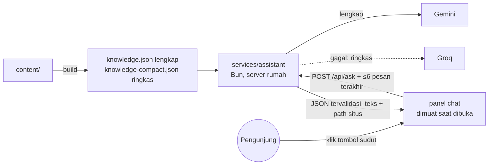

# 11 · Rencana lanjutan (Fase 9–14)

> Disusun 2026-10-07 setelah situs online dan Fase 0–8 selesai. Dokumen ini menjelaskan **apa** yang dibangun setelah peluncuran, **kenapa**, dan pilihan yang dulu diajukan ke pemilik. **Semua keputusan D8–D21 sudah diambil pemilik** (2026-10-07 sampai 2026-10-10); keputusannya tercatat di awal tiap bagian dan di tabel [Keputusan](#keputusan) di bawah. Bila keputusan berbeda dari rekomendasi awal, yang berlaku adalah keputusannya. Daftar tugas yang bisa dicentang ada di [`PROGRESS.md`](../PROGRESS.md) (Fase 9–14).
>
> **Status (2026-10-10):** Fase 9–12 selesai (rilis 1.1.0–1.4.0); chatbot dan formulir kesan & pesan tayang 2026-10-09. Rencana Fase 13–14 ditulis ulang 2026-10-10 (§H, §I). Berikutnya Fase 13.
>
> Prinsip lama tetap berlaku: satu sumber data (`content/`), situs tetap utuh tanpa JS dan saat server mati, tanpa secret di repo, tanpa skrip pihak ketiga tanpa ADR, dan teks buatan AI selalu ditinjau pemilik.

## Ringkasan

| Fase | Isi | Kenapa | Ukuran |
|---|---|---|---|
| 9 ✅ | **Personal branding & konten**: positioning, baris peran, skill lebih lengkap, terjemahan studi kasus, kesan & pesan (tampilan), format angka | Pondasi untuk fase lain; kebanyakan isi, sedikit kode | Kecil–sedang |
| 10 ✅ | **CV per posisi**: AI/ML, Data Engineer, Data Analyst, Product Manager, Project Manager, Management Trainee (versi khusus perusahaan batal, D10) | Satu CV umum kalah relevan di ATS dibanding CV yang menyorot hal yang dicari | Sedang |
| 11 ✅ | **Chatbot "Tanya Harry"** di sudut setiap halaman | Recruiter mendapat jawaban cepat; menunjukkan kemampuan LLM secara langsung | Besar (layanan baru, ADR) |
| 12 ✅ | **Formulir kesan & pesan** dengan moderasi | Bukti sosial dari orang lain tanpa membuka kolom komentar bebas | Sedang |
| 13 | **Tampilan baru Giok → Nila** dan beranda "satu ruang" 3D | Situs terasa buatan AI dan datar; 3D yang bercerita tentang pekerjaan pemilik | Besar |
| 14 | **Halaman lain** dalam ruang 3D yang sama (Projects, About, Statistik, 404) | Satu dunia yang utuh di seluruh situs | Sedang |

Urutan: 9 → 10 → 11 → 12 → 13. Fase 10 dan 11 sama-sama memakai hasil Fase 9 (positioning dan skill), jadi jangan dibalik. Fase 12 tidak lagi opsional (D15). Fase 13 dikerjakan setelah Fase 11 dan 12, lalu Fase 14 setelah Fase 13 (D21). Setiap fase ditutup dengan tugas penutupan (`AGENTS.md` §2a).

---

## A. Personal branding: AI Engineer, Product, Data, atau semuanya?

**Keputusan (D8, D9, 2026-10-07):** baris peran **AI Product Manager**; positioning AI Product Manager dengan kemampuan AI engineering sebagai pembeda (suara produk lebih dulu). Ini menggantikan rekomendasi "AI Engineer" di bawah. Dikerjakan di T9.1.

**Masalahnya.** Pemilik bisa di beberapa jalur: AI Engineer, Product/Project Manager, Data Engineer, Data Analyst. Kalau situs mengaku semuanya sejajar ("AI Engineer | PM | Data Engineer | Analyst"), pembaca tidak tahu Anda ahli di mana, dan setiap jalur terlihat setengah-setengah.

**Rekomendasi: satu identitas utama + kekuatan pendukung (bentuk "T").**
- **Identitas utama di website: AI Engineer.** Bukti terkuat ada di sini (riset hibah, edge AI, computer vision real-time, mengajar ML ke 75+ peserta).
- **Pembeda: "yang membangun produk sampai jadi"**, bukan hanya model. Bukti: Decklify (peluncuran komersial 3 bulan, NPS +45, model bisnis), Dompet Juara, portfolio ini sendiri. Inilah jembatan ke Product/Project.
- **Data Engineering/Analyst sebagai kemampuan pendukung**: Netflix data warehouse + ETL, forecasting saham, analisis. Tampil di skill dan proyek, tidak di judul.
- **Penargetan per posisi dilakukan oleh CV (Fase 10), bukan oleh website.** Website = etalase umum yang konsisten; CV = surat yang disesuaikan untuk tiap lamaran. Ini juga cara kebanyakan profesional menangani beberapa jalur.

Contoh hasilnya:

| Tempat | Sekarang | Usulan |
|---|---|---|
| Baris peran (hero, CV umum, sampul Portfolio, JSON-LD `jobTitle`) | AI Engineer · Founder, Decklify | **AI Engineer** atau **AI Engineer · AI products, end to end** |
| Tagline | I turn video, speech, and text into AI products people can actually use… | Tetap (sudah menyiratkan produk) |
| Ringkasan | … | Ditinjau ulang setelah D8: satu kalimat produk/data ditambahkan |

**Tentang "AI Engineer · Founder, Decklify" (pertanyaan pemilik): sebaiknya diubah.** Baris itu dibaca pertama kali oleh recruiter. "Founder" di posisi paling atas bisa ditangkap sebagai "sedang sibuk dengan startup sendiri, mungkin tidak bisa full-time", dan nama Decklify belum dikenal. Decklify tetap tampil kuat di Pengalaman, Journey, dan Projects. Baris itu juga dipakai di CV dan JSON-LD, jadi CV per posisi (Fase 10) nanti punya baris perannya sendiri.

Pilihan yang dulu diajukan untuk D8: (a) "AI Engineer", (b) "AI Engineer · AI products, end to end", (c) tulisan Anda sendiri.

## B. CV per posisi (dan per perusahaan?)

**Keputusan (D10, 2026-10-07 dan 2026-10-08):** 6 varian (Product dan Project Manager terpisah), PDF dibuat saat deploy di `/downloads/cv/`, didaftar di halaman `/cv/` yang ditautkan di footer (noindex). **CV per perusahaan tidak dibuat** (poin 4 batal). CV umum memakai baris peran AI Product Manager (D8).

**Rekomendasi: varian per posisi dari data yang sama; versi per perusahaan hanya privat.**

1. **Satu CV umum** tetap di website (versi AI Engineer), seperti sekarang.
2. **Varian per posisi**, didefinisikan di `content/cv-variants.yaml`. Setiap varian hanya **memilih dan mengurutkan**, tidak mengarang:
   - baris peran dan ringkasan sendiri (EN + ID);
   - urutan bagian (mis. Product: Pengalaman Decklify di atas; Data Engineer: Skill data dulu);
   - poin mana yang tampil: setiap poin di `highlights` diberi label fokus (`ai`, `data`, `product`, `leadership`), lalu varian memilih label yang relevan;
   - grup skill dan urutannya.
3. **Varian awal yang diusulkan:** AI/ML Engineer (umum), Data Engineer, Data Analyst, Product Manager / Project Manager, Management Trainee. Mana yang dibuat dan apakah publik: **D10**.
4. **Per perusahaan:** cukup baris "ringkasan" yang disesuaikan + nama file (mis. `Harry-Mardika-CV-Data-Engineer-PT-X.pdf`), dibuat **di laptop** dengan `bun run cv --variant data-engineer --company "PT X"`, **tidak pernah di-upload ke situs atau repo** (nama perusahaan yang dilamar bersifat pribadi). Kombinasikan dengan link pelacak `?ref=` yang sudah ada (docs/08 §4).
5. **Nanti (opsional):** dari teks lowongan, AI menyarankan varian, poin yang ditonjolkan, dan kata kunci yang belum ada di CV; pemilik memutuskan. Tetap tanpa mengarang pengalaman.

Batas yang dijaga: maksimal 2 halaman per varian (dites), ATS-friendly, tanpa nomor HP, semua angka dari `content/`.

## C. Skill lebih lengkap

**Keputusan (D11, 2026-10-08):** semua kandidat dikonfirmasi satu per satu oleh pemilik; `skills.yaml` menjadi 8 grup, dan grup yang tidak muat di CV umum ditandai `show_on_cv: false` (T9.2).

**Masalahnya.** `content/skills.yaml` hanya 5 grup dan ±25 item; banyak yang sudah terbukti di proyek belum tercantum (mis. Python, SQL, LangChain, OpenCV, Streamlit, Prometheus/Grafana), dan pemilik menyebut GCP dan LangChain.

**Rekomendasi:**
- **Aturan emas: hanya skill yang sanggup Anda jelaskan saat wawancara.** Recruiter teknis sering menanyakan satu skill acak dari CV.
- Grup baru yang lebih mudah dipindai ATS: *AI & ML* · *LLM & Generative AI* · *Data* · *Cloud & MLOps* · *Web & produk* · *Produk & manajemen* · *Kepemimpinan* · *Bahasa*.
- Daftar kandidat disusun dari bukti yang sudah ada di `content/` (tag proyek/pengalaman) + yang disebut pemilik; **pemilik mencentang** mana yang dipakai (D11). Kandidat yang perlu konfirmasi karena belum ada buktinya di repo: GCP (layanan apa: Vertex AI, BigQuery, Cloud Run?), LangChain, SQL, Pandas/NumPy, scikit-learn, Airflow, Spark, Power BI/Tableau/Looker, Figma, Jira/Notion, Scrum/Agile, Git/Linux.
- Di website semua tampil per grup; di CV tiap varian menampilkan grup yang relevan (Fase 10). Tanpa "bar persentase" (tidak ramah ATS, sudah dilarang docs/09).

## D. Studi kasus berbahasa Indonesia

**Keputusan (D12, 2026-10-07): pilihan (c)**, semua 11 studi kasus diterjemahkan; istilah teknis/asing tetap bahasa Inggris. Selesai dan ditinjau pemilik 2026-10-08 (T9.3).

Ringkasan, peran, dan angka sudah dwibahasa; isi Problem/Approach/Result hanya bahasa Inggris dengan catatan. Pilihan (**D12**):
- **(a) Rekomendasi:** catatan diganti menjadi "Ringkasan di atas dalam bahasa Indonesia; detail teknis ditulis dalam bahasa Inggris." (1 baris teks UI).
- **(b)** Dukungan terjemahan body `content/projects/id/<slug>.md` dengan fallback ke Inggris, lalu terjemahkan hanya Decklify dan Dompet Juara dulu. Termasuk: menu CMS baru, Portfolio PDF ID memakai terjemahan, tes kesamaan struktur (judul bagian dan gambar) agar dua versi tidak melenceng.
- **(c)** Seperti (b) untuk semua 11 studi kasus (±2.000 kata; draf oleh AI, ditinjau pemilik). Biaya: setiap edit dikerjakan dua kali.

## E. Chatbot "Tanya Harry" di sudut (Fase 11, D13, D14)

**Keputusan (2026-10-08):** chatbot mengambang di sudut kanan bawah setiap halaman (D13); Gemini utama, Groq cadangan, teks pertanyaan tidak disimpan (D14). Pratinjau: https://claude.ai/artifact/9bHCrGGLHm7t1BJoh2fV7a.

**Hasil (2026-10-09, ✅):** tayang dengan `gemini-3.5-flash-lite` (kuota gratis 500/hari; `gemini-3.5-flash` hanya 20/hari) dan key `ASSISTANT_*` tersendiri (ADR 0015); eval 30/30 (`docs/assistant-eval.md`); pemberitahuan privasi dilipat di balik tautan "Privacy". Rencana di bawah dipertahankan sebagai catatan desain.

**Tujuannya.** Pengunjung (terutama recruiter) bertanya dalam bahasa sehari-hari: "Pernah pakai YOLO di produksi?", "Apa peran Harry di Decklify?". Jawaban singkat dari isi situs, dengan tautan ke halaman terkait.

- **Layanan terpisah** `services/assistant` (image sendiri, 128 MB, read-only, tanpa volume): key AI hanya ada di sini; gangguan AI tidak memengaruhi statistik.
- **Pengetahuan = isi situs saja**, dibuat saat build (T11.1, [ADR 0014](adr/0014-ask-harry-assistant.md)). Dua ukuran: lengkap (EN+ID dengan isi studi kasus, ±16 ribu token, Gemini) dan ringkas (EN tanpa detail, ±4,1 ribu dari batas 5 ribu token, Groq; model gpt-oss di Groq dibatasi 8 ribu token/menit). Tanpa vector DB.
- **Tanpa penyimpanan:** browser mengirim maksimal 6 pesan terakhir setiap bertanya; percakapan hanya di `sessionStorage` tab itu. Server mencatat jumlah, bukan teks.
- **Batas:** 1–500 karakter per pertanyaan; 10/jam dan 30/hari per pengunjung (hash harian, tanpa IP); 300/hari total; ≤ 3 permintaan bersamaan; timeout 20 s.
- **Pengaman jawaban:** prompt membatasi topik dan menolak data pribadi; jawaban JSON divalidasi (teks biasa, tautan hanya path situs yang ada, pola nomor HP ditolak); kill switch `ASSISTANT_ENABLED`.
- **Widget:** tombol kecil di semua halaman (bukan halaman cetak), tersembunyi tanpa JS; panel dimuat saat diklik sehingga Lighthouse tidak turun; dialog ramah keyboard/pembaca layar; lembar bawah di HP; saat server mati atau batas habis menampilkan tautan CV dan email; pemberitahuan privasi (Gemini tier gratis boleh memakai isi permintaan untuk memperbaiki produknya).
- **Uji:** ±30 pertanyaan (fakta, di luar topik, data pribadi, prompt injection) lewat workflow manual dengan secret repo; hasil dicatat sebelum fitur dinyalakan.
- **Biaya:** gratis dalam kuota tier gratis; batas harian mencegah kuota habis.

## F. Komentar atau testimoni dari orang lain

**Keputusan (D15, 2026-10-07):** langsung dengan formulir bermoderasi (Fase 12 tidak opsional); tidak ada yang tampil sebelum disetujui pemilik.

> **Hasil (2026-10-09, ✅):** formulir `/messages/` (tanpa email penulis), antrean privat di layanan stats, halaman tinjau ber-token, satu PR antrean dengan terjemahan AI, notifikasi harian lewat issue berisi jumlah saja (ADR 0017). Diuji live ujung ke ujung. Turnstile belum diperlukan.

> **Pembaruan 2026-10-08:** atas permintaan pemilik, istilahnya menjadi **kesan & pesan** ("Kind words"): pesan yang ditinggalkan orang lain untuk pemilik. Tahap 1 sudah dibangun di `content/messages.yaml` (T9.4), bukan `testimonials.yaml`; Portfolio PDF belum memuatnya. Rancangan di bawah tetap berlaku dengan nama baru.

**Rekomendasi: bukan kolom komentar bebas, melainkan testimoni yang dikurasi.** Kolom komentar terbuka di portfolio mengundang spam dan pesan yang tidak relevan, butuh moderasi setiap hari, dan satu komentar buruk tampil di depan recruiter. Yang memberi nilai adalah **rekomendasi dari orang yang pernah bekerja dengan Anda**.

- **Tahap 1 (Fase 9, statis):** `content/testimonials.yaml`: nama, peran, hubungan ("atasan di …", "peserta bootcamp"), kutipan EN/ID, tautan LinkedIn opsional, **tanggal persetujuan**. Tampil 2–4 testimoni di beranda/About, dan opsional di Portfolio PDF. Sumber: rekomendasi LinkedIn, pesan dari peserta/mentor, dengan izin orangnya.
- **Tahap 2 (Fase 12):** formulir "Tulis testimoni" → tersimpan sebagai **antrean moderasi** (SQLite di server, tidak pernah tampil otomatis) → pemilik meninjau (perintah `bun run testimonials` atau halaman privat ber-token) → yang disetujui masuk `testimonials.yaml` lewat Pull Request. Anti-spam: honeypot + batas per IP; Cloudflare Turnstile hanya jika perlu (skrip pihak ketiga, butuh ADR + perubahan CSP).
- Keputusan: **D15**.

---

## G. Format angka yang konsisten

Pemilik meminta penulisan angka desimal konsisten di semua tempat (IPK, akurasi, persentase). Saat ini halaman Indonesia mengikuti aturan baku PUEBI (koma desimal: `3,99`, `92,5%`; titik ribuan: `12.000`), sedangkan halaman Inggris memakai titik desimal.

**Keputusan (D16, 2026-10-08): ikuti aturan baku tiap bahasa.** Usulan awal "titik untuk semua" ditarik karena menyimpang dari PUEBI. Teks ditulis per bahasa; nilai yang ditulis sekali (angka hero, angka utama proyek, IPK) ditulis gaya Inggris dan diubah otomatis di halaman Indonesia. Dijaga tes (T9.5).

## H. Tampilan baru dan "satu ruang" 3D (Fase 13–14, D18–D21)

**Keputusan (2026-10-10):** warna **Giok → Nila** (D18), H1 beranda = **nama pemilik** (D19), Projects memakai **daftar indeks** (D20), dan arah 3D **"satu ruang"** (D21). D21 menggantikan D17: peta embedding, rasi skill, dan globe pengunjung batal; 404 ala computer vision tetap. Pratinjau (privat): [satu ruang 3D, Giok → Nila](https://claude.ai/artifact/Xkm8xfNPp6m1d1ijtf64jb) dan [diagnosis, hero foto + aksara, konveyor](https://claude.ai/artifact/ERboSgCo7gpAGg1LZoNe1t). Daftar tugas: Fase 13 dan 14 di [`PROGRESS.md`](../PROGRESS.md).

### Masalahnya

Pemilik merasa situs terlihat seperti buatan AI, datar, dan warnanya kurang hidup. Penyebab yang ditemukan di situs yang berjalan:

| Yang ada sekarang | Kenapa terasa "AI" atau datar | Gantinya |
|---|---|---|
| Kata terakhir judul diwarnai amber ("useful.", "founder.", "talk.") | Pola paling umum di halaman buatan generator | Judul satu warna; amber untuk tombol dan kotak deteksi, `amber-deep` hanya untuk angka dan tahun |
| Badge pil peran, label mono huruf kapital ("JOURNEY · 2022 → 2026", "CONTACT") | Hiasan template yang muncul di mana saja | Dihapus; font mono hanya untuk keluaran mesin |
| Tiga angka besar tanpa konteks; kartu proyek juga dibuka angka besar | Pola "statistik besar" bawaan | Angka dengan konteks dalam satu baris |
| Bola dan cincin dekoratif di sekitar kartu foto | 3D yang tidak bercerita | 3D dari pekerjaan pemilik: deteksi, aksara, konveyor, homelab |
| Semua isi berupa kartu putih identik (20 proyek, 5 kontak) | Kit kartu SaaS | Daftar berbaris dan tipografi |
| Warna rata, 3D terkurung di dalam kotak, tidak ada yang bertumpuk | Tidak ada cahaya dan kedalaman | Satu sumber cahaya, bayangan sungguhan di halaman, benda bertumpuk |
| Rencana Fase 13 lama (titik bercahaya, rasi bintang, globe titik) | Motif paling umum di portfolio AI | Diganti (D21) |

### Konsep: satu ruang yang dijelajahi kamera

Satu kanvas 3D menempel di belakang seluruh halaman; **semua teks, tombol, tautan, dan formulir tetap HTML** di atasnya. Saat pengunjung scroll, kamera bergerak melewati "ruangan". Bahan visualnya satu: **kertas cetak** (foto, lembar aksara, kartu proyek, catatan pesan) di ruangan yang diterangi satu lampu, sehingga bayangan jatuh ke dinding dan lantai halaman.

Beranda (Fase 13), mengikuti urutan bagian yang sudah ada:

1. **Hero:** foto cetak di depan lembar aksara Jawa bertuliskan "Harry Mardika". Kotak deteksi mengenali wajah (`person` → nama), lalu model skripsi "membaca" aksara satu per satu (ha, ra, ma, da, ka) dan transliterasinya muncul. Diputar sekali saat halaman dibuka.
2. **Journey:** benang turun dari bawah lembar aksara melewati titik-titik `journey.yaml`; bola mengikuti scroll, titik yang dilewati menyala, dan titiknya bisa diklik untuk membuka detail yang sama dengan daftar.
3. **Proyek pilihan:** benang tiba di lantai, di jalur sortir (dari proyek Reclaimyt): kamera di atas konveyor mendeteksi bidang setiap proyek, lalu pendorong memasukkannya ke wadah bidangnya.
4. **Kind words:** pesan sebagai kertas yang ditempel; teksnya tetap HTML, beserta tombol "Leave a message".
5. **Kontak:** laptop homelab yang melayani situs ini, layarnya menampilkan beranda.

Halaman lain (Fase 14) adalah sudut lain dari ruangan yang sama: **Projects** konveyor penuh, **About** dinding penghargaan dan sertifikat berbingkai, **Statistik** meja laptop homelab dengan status server, **404** kotak deteksi yang memindai dinding kosong. Halaman lain tetap tanpa 3D, tetapi memakai warna dan tipografi baru.

### Warna: Giok → Nila

- **Gelap:** dinding hijau giok tua di hero, berubah pelan menjadi biru-hijau tua di Journey, lalu biru nila tua di kontak, seperti siang menuju malam.
- **Terang:** warna yang sama tetapi muda (giok pucat → nila pucat), dengan teks gelap. Tema terang tetap default bila sistem pengunjung terang, seperti sekarang.
- **Amber** tetap untuk tombol utama dan kotak deteksi. Latar biru foto (D3) kini menyatu dengan ujung nila.
- Perubahan warna dibuat dengan **gradasi CSS panjang** di latar halaman, jadi tetap terlihat tanpa JS. 3D hanya menambah cahaya dan bayangan.
- Halaman lain memakai satu titik tetap di gradasi: About giok, Projects tengah, Statistik dan 404 nila, lainnya tengah.
- Kontras dicek otomatis untuk semua pasangan teks di kedua tema, termasuk titik antara gradasi.

### Desain teknis

- **Satu renderer per halaman** (`src/scenes/room/`, ADR 0019) menggantikan dua scene terpisah di beranda. Dimuat lewat dynamic import setelah LCP; kontrak `SceneHandle` dan keputusan `decide3D` tetap (ADR 0007 tetap berlaku).
- **Jalur kamera** dihitung dari posisi bagian-bagian HTML (titik jangkar), jadi tata letak tetap ditentukan HTML. Fungsi interpolasinya murni dan dites.
- **Tingkatan perangkat:**
  - Penuh: bayangan real-time.
  - Sedang: bayangan statis.
  - `off` (tanpa WebGL, renderer CPU, ≤ 2 core, Save-Data): HTML dengan foto dan gambar lembar aksara berbayangan CSS.
  - `still` (reduced motion): kamera berpindah tanpa terbang, tanpa animasi otomatis.
- **Performa:** menggambar ulang hanya saat ada perubahan (scroll, pointer, animasi yang sedang berjalan); ruangan dibuat saat didekati; DPR maksimal 2 dan bayangan diturunkan di HP. Anggaran ≤ 180 KB gzip JS 3D per halaman (three.js sekarang ±136 KB); Lighthouse ≥ 90/95; LCP < 2,5 s di HP.
- **Aksara:** gambar lembar dan koordinat kotaknya dibuat sekali oleh `scripts/generate-aksara.ts` dan di-commit, jadi browser tidak memuat font aksara Jawa. Label kelas hanya nama kelas; skor asli opsional bila pemilik menjalankan modelnya pada gambar itu.
- **Teks di dalam 3D** (label deteksi, nama wadah, keterangan) diambil dari kamus UI dan ikut bahasa halaman.
- **Data 3D dari `content/`:** proyek, kategori, milestone, pesan, penghargaan; tidak ada daftar yang ditulis di kode scene.
- **Yang tidak berubah:** halaman cetak dan PDF (ATS), CSP (tanpa skrip atau font pihak ketiga), statistik dan pelacak `?ref=`, chatbot, formulir pesan, sinkronisasi GitHub, CMS, workflow AI.

### Risiko dan cara menjaganya

| Risiko | Penjagaan |
|---|---|
| Fitur lama hilang saat tampilan dirombak | Daftar §I + `tests/e2e/feature-inventory.spec.ts` dibuat **sebelum** tampilan diubah (T13.0) dan harus lulus di setiap tugas |
| HP lemah tersendat | Tingkatan perangkat, gambar ulang hanya saat perlu, pengujian di HP sungguhan sebelum rilis |
| Teks sulit dibaca di atas 3D | Kolom teks dengan scrim (desktop) atau panel (HP); tes kontras gradasi |
| Kamera dan scroll terasa berat | Kamera hanya mengikuti scroll, tanpa scroll-jacking; reduced motion dihormati |
| Lighthouse turun | CI mengukur fallback (tanpa GPU); 3D dimuat setelah LCP; angka pembanding dicatat di T13.0 |

## I. Fitur yang wajib tetap ada

Daftar ini dijaga oleh `tests/e2e/feature-inventory.spec.ts` (T13.0), di EN dan ID, desktop dan HP. Butir baru ditambahkan bila fitur baru dibangun. Tes lain yang sudah ada tetap berlaku.

| Area | Fitur |
|---|---|
| Semua halaman | Skip link; navigasi Projects/About; ganti bahasa EN/ID dengan `hreflang`; tombol tema terang/gelap tanpa kedip; menu HP; footer (Site statistics, Resumes, Leave a message, ikon LinkedIn/Instagram/GitHub/Medium/email); chatbot "Tanya Harry" di sudut saat layanannya menyala; beacon statistik dan pelacak `?ref=`; meta SEO, JSON-LD, gambar OG |
| Beranda | Nama, peran, tagline; tombol **Download CV** dan **Portfolio PDF** (atribut `download` dan `data-download`); tiga angka pencapaian; Journey dengan detail milestone yang bisa dibuka (juga tanpa JS); tiga proyek pilihan + tautan semua proyek; Kind words + tautan "Leave a message"; Kontak: email + tombol salin + media sosial, tanpa nomor HP |
| Projects | Pencarian; filter bidang dengan jumlah; tautan `?filter=`; semua studi kasus dan repo GitHub; tautan ke studi kasus |
| Studi kasus | Isi EN/ID, angka utama, peran, tautan repo/demo, gambar |
| About | Ringkasan, pengalaman, pendidikan, penghargaan, sertifikat aktif (yang kedaluwarsa hilang otomatis), skill |
| CV per posisi `/cv/` | Enam varian dengan PDF EN/ID; noindex |
| Statistik `/stats/` | Statistik situs publik dan status server; tetap tampil saat API mati |
| Kesan & pesan | Formulir `/messages/` (juga tanpa JS), halaman terkirim/belum terkirim, halaman tinjau privat `/messages/review/` |
| 404 | Teks dan tautan kembali |
| Di luar tampilan | Halaman cetak dan PDF (CV EN/ID, Portfolio EN/ID, enam varian); sitemap dan robots; CSP dan header keamanan; sinkronisasi GitHub; Pages CMS; draf studi kasus AI; workflow kind words |

## Keputusan

Semua sudah diputuskan pemilik. Rekomendasi awal dan alasannya ada di bagian masing-masing di atas.

| No | Pertanyaan | Keputusan pemilik | Tugas |
|---|---|---|---|
| D8 | Baris peran (hero, CV umum, Portfolio, JSON-LD) | **AI Product Manager** (2026-10-07) | T9.1 |
| D9 | Positioning | **AI Product Manager dengan kemampuan AI engineering** (2026-10-07) | T9.1, Fase 10 |
| D10 | Varian CV mana, dan apakah ditaruh di website | **6 varian**, PDF di `/downloads/cv/`, halaman `/cv/` ditautkan di footer (noindex); tanpa CV per perusahaan (2026-10-07; varian dan `/cv/` 2026-10-08) | T10.x |
| D11 | Skill tambahan yang benar-benar dikuasai | **Semua kandidat**, dikonfirmasi satu per satu (2026-10-08) | T9.2 |
| D12 | Studi kasus bahasa Indonesia | **(c) Terjemahkan semua**, istilah teknis tetap bahasa Inggris (2026-10-07) | T9.3 |
| D13 | Asisten AI: lanjut dan letaknya | **Lanjut, chatbot di sudut kanan bawah** setiap halaman, bukan halaman cetak (2026-10-08) | Fase 11 |
| D14 | Asisten AI: penyedia dan penyimpanan | **Gemini utama, Groq cadangan**; teks pertanyaan tidak disimpan (2026-10-08) | T11.x |
| D15 | Kesan & pesan: statis saja, atau juga formulir | **Langsung dengan formulir bermoderasi** (2026-10-07) | T9.4, Fase 12 |
| D16 | Format angka | **Aturan baku tiap bahasa** (EN `92.5%`, ID `92,5%`) (2026-10-08) | T9.5 |
| D17 | 3D tambahan | ~~Keempatnya~~ (2026-10-08); **diganti D21** (2026-10-10), hanya 404 yang tetap | — |
| D18 | Warna situs | **Giok → Nila**, terang = versi muda, amber tetap; menggantikan palet Hijau ADR 0006 (2026-10-10) | T13.1 |
| D19 | Judul hero | **Nama pemilik** sebagai H1 (2026-10-10) | T13.2 |
| D20 | Tampilan Projects | **Daftar indeks** menggantikan grid kartu; pencarian dan filter tetap (2026-10-10) | T14.1 |
| D21 | Arah 3D | **"Satu ruang"**: satu kanvas di belakang setiap halaman, isi tetap HTML; beranda lima ruang, Projects konveyor, About dinding penghargaan, Statistik laptop homelab, 404 deteksi (2026-10-10) | Fase 13–14 |
